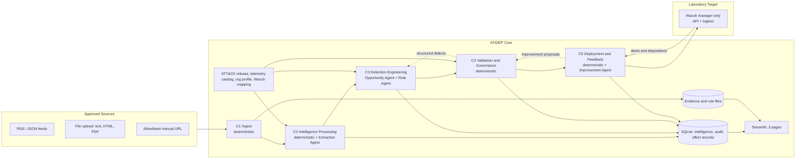

# ATIDEP Full Project Blueprint (v3)

## Agentic Threat Intelligence and Detection Engineering Platform

> **Project positioning:** ATIDEP is the technical solution: a governed, open-source pipeline that turns selected threat intelligence into validated, human-approved detection content for a laboratory Wazuh target. The research contribution is a controlled evaluation of that pipeline against a manual workflow and against a single-prompt LLM baseline. Cost is a secondary, descriptive dimension (see §2.4 and §22).

**Program:** Professional Master's in Information and Cyber Security (PMICS)  
**Institution:** University of Dhaka  
**Project Type:** Master's Final Project in Cybersecurity  
**Prepared for:** Supanta Dutta  
**Document version:** 3.0 (supersedes 2.0, archived at `docs/archive/ATIDEP_Blueprint_v2.md`)  
**Date:** 2 October 2026

---

## 0. Document Control and Change Log from v2

v3 keeps the v2 architecture and governance ideas (evidence grounding, deterministic-before-generative, human-gated deployment) and changes the parts that would have weakened the thesis: the validation logic, the Sigma→Wazuh feasibility assumptions, the experiment design, and the scope-versus-schedule balance.

### 0.1 What changed and where

| # | Problem in v2 | Resolution in v3 | Section |
|---|---|---|---|
| 1 | The quality score could pass broken rules: a rule scoring 0 on the functional test could still reach 90 ("eligible for deployment"), and a missing-telemetry rule could reach 80 ("human review") while Scenario 5 said it was blocked. | Syntax, evidence, field validity, telemetry, ATT&CK and test results are **hard pass/fail gates**. The score only ranks rules that already passed. | 17.4 |
| 2 | "Agentic" was thin: a linear pipeline of ten "agents", most of them deterministic code. | Five components; only LLM-reasoning parts are called agents; a **bounded generate → validate → repair loop** gives measurable first-pass versus post-repair validity. | 11, 17.3 |
| 3 | IOC-per-rule Sigma generation (a known anti-pattern). | IOCs go into a **Wazuh CDB list plus one rule template**; Sigma is for behaviours. | 17.3.4, 20.4 |
| 4 | Confidence used 0–100 in the data model but 0–1 in opportunities and `policies.yaml`. | One scale everywhere: **integers 0–100**. | 16.1 |
| 5 | Priority bands left a gap (79.75 fell between "60–79" and "80–100"). | Half-open intervals. | 17.2.5 |
| 6 | Sigma→Wazuh conversion was treated as routine and scheduled for week 12. | An explicit **Wazuh-compatible Sigma subset**, a converter that refuses what it cannot translate faithfully, and a **week-1 spike**. | 20, 21 |
| 7 | `wazuh-logtest` may not simulate Windows Event Channel events (single secondary source, unverified). | Spike S1 tests it first; a fallback ladder is defined; a Sigma-level test tier removes the dependency. | 20.6, 21 |
| 8 | Memory budget: all-in-one Wazuh recommends 8 GB. | Manager-only Wazuh (no indexer/dashboard), measured in spike S2. | 24, 21 |
| 9 | SSH-style deployment risk. | Deployment through the Wazuh API with a least-privilege RBAC user and a hard-coded endpoint allowlist. | 20.5 |
| 10 | Carry-over bias: one analyst, same items, both conditions. | Stratified randomisation, **counterbalanced crossover with washout**, first-exposure-only sensitivity analysis, an optional independent-analyst subset. | 27.5 |
| 11 | Circular quality metric: the validator score both gated and judged rules. | **Blinded expert rubric + held-out detection + benign false-positive rate**; the validator score is never an outcome metric. | 27.8 |
| 12 | No ablation. | Condition C (single-prompt LLM) and ablations without validators / without the repair loop. | 27.1 |
| 13 | H3 had no experiment. | **Seeded bad-rule set** and **prompt-injection report set**. | 27.6 |
| 14 | H4 ("no significant reduction") is not equivalence. | **Non-inferiority test** with a pre-set margin. | 9, 29 |
| 15 | H1's 30% was arbitrary; endpoint was wall-clock time. | Primary endpoint is analyst *active* minutes; threshold fixed from the pilot before the main run. | 9 |
| 16 | H5 measured false positives on a strawman. | Public attack datasets for positives; a lab-generated benign baseline plus hand-built look-alikes. | 27.7 |
| 17 | H6 compared against a commercial baseline that was never measured, and against a manual workflow with no software cost. | H6 is dropped. A **break-even analysis** replaces ROI %. | 22 |
| 18 | LLM variance and training-data contamination ignored. | Pinned model, ≥3 runs per item, post-cutoff reports, SigmaHQ similarity check. | 27.9 |
| 19 | Ground truth labelled by the system's builder alone. | Second labeler on a sample; Cohen's κ; labels frozen and hashed before the main run. | 27.3 |
| 20 | Scope: 10 agents, 7 dashboard pages, 23 tables, 21 endpoints in 16 weeks, experiments in week 15. | Cut list, 5 components, 3 UI pages, 16 tables, freeze at end of week 12, experiments in weeks 13–15. | 10.3, 26 |
| 21 | Security gaps. | SSRF guard, sandboxed document parsing, IOC refanging, benign-domain allowlist, verbatim-quote check, tool-less extraction model. | 19 |
| 22 | "Environmental relevance", "potential impact" and source reliability were undefined. | Defined, with a synthetic organisation profile. | 17.2.5 |
| 23 | Editorial: subsection numbers did not match sections; "a open-source" typo; success statement near-unfalsifiable; cost positioned as both secondary and central. | Renumbered; fixed; success split into engineering criteria and reported-either-way research outcomes; one cost lane. | throughout |
| 24 | Cost story blurred between the solution and the paper, and "cost-effective with open source" was never defined measurably. | One cost story in two registers with a fixed interface; three pre-registered cost-effectiveness checks (C1-C3); a dedicated paper chapter; local-first inference with a cloud opt-in cap; an open-source claim audit. | 2.4, 22 |

### 0.2 How to read the status of claims about Wazuh

Wazuh and Sigma-tooling statements were checked against primary sources on 2 October 2026 where possible: the Wazuh documentation source (stable branch `4.14`, commit `617f407`, dated 2026-09-30) and the READMEs of the two community converters. The Wazuh documentation website itself was blocked by the authoring environment's network policy, so the checks used the public documentation repository. Statements that are still unverified are marked **[verify: Sn]**, where *Sn* is the spike (§21) that settles it, and all open items are in §42. Treat marked statements as hypotheses to confirm in weeks 1–2.

---

## 1. Project Summary

This project will design, implement, and evaluate an **open-source Agentic Threat Intelligence and Detection Engineering Platform named ATIDEP**. The platform collects cyber threat intelligence from a small set of approved sources, normalises it, extracts evidence-linked indicators and adversary behaviours, calculates a transparent priority, decides whether the intelligence supports a defensible detection, generates Sigma rules (for behaviours) or Wazuh CDB lists (for indicators), validates the generated content through hard gates and tests, and prepares human-approved detections for controlled deployment to a laboratory Wazuh manager.

After deployment or simulation, ATIDEP collects detection results and analyst dispositions and recommends rule improvements that go back through validation and approval. Lightweight instrumentation records analyst time, model usage, and resource use so that effort and cost can be analysed in the research paper.

The project compares three conditions under a pre-registered protocol: a **manual** detection-engineering workflow, the **full ATIDEP workflow** with human review, and a **single-prompt LLM baseline** with no pipeline. Outcomes are analyst effort, rule validity, independently judged rule quality, detection behaviour on held-out events, safety-gate effectiveness, and cost.

ATIDEP is not intended to replace analysts. It automates repetitive steps, preserves evidence traceability, explains its recommendations, and keeps every deployment decision under human and policy control.

---

## 2. Binding Project Decisions

ATIDEP is **one technical artifact supported by one research evaluation**.

### 2.1 Technical artifact

```text
Collect CTI
→ Sanitise, normalise, and extract evidence-linked claims
→ Enrich and prioritise
→ Decide whether a detection opportunity exists
→ Generate a Sigma rule (behaviour) or an IOC list (indicators)
→ Validate: hard gates, then tests
→ Obtain human approval
→ Export, dry-run, or deploy to a laboratory Wazuh manager
→ Evaluate alerts
→ Recommend improvements (back through validation and approval)
```

### 2.2 Research evaluation

The paper evaluates ATIDEP on extraction accuracy, detection-opportunity accuracy, ATT&CK mapping accuracy, rule validity (first-pass and post-repair), independently judged rule quality, detection on held-out events, false-positive behaviour on benign events, safety-gate effectiveness against seeded defects and prompt injection, analyst effort, resource utilisation, and (descriptively) cost.

### 2.3 Binding scope decision

The minimum viable product uses **Python, FastAPI, Streamlit, SQLite, Sigma, MITRE ATT&CK, two or three public CTI input types, and a manager-only Wazuh instance as the laboratory target**. STIX/TAXII ingestion, MISP, OpenCTI, and correlation-graph visualisation are out of the MVP (§10.3).

ATIDEP is agentic but not dangerously autonomous. LLM agents may extract, reason, draft, and recommend, but they have no tools, cannot execute anything, and cannot deploy. Deployment requires passing every hard gate plus a recorded human approval bound to the exact rule content. The platform never executes model-generated commands.

### 2.4 Cost-positioning decision (one story, two registers)

Cost-effectiveness is part of the project's purpose: the claim is that a fully open-source pipeline can do this job without significant spending. To stop the solution and the paper from blurring into each other, cost is organised as **one story told in two registers, with a fixed interface**.

| | Solution (project plan) | Paper |
|---|---|---|
| Role | Constraint and measurement: be cost-aware by construction | Research dimension: analyse, and be explicit about assumptions |
| Contains | Open-source-only stack with a bill of materials and licence audit; local-first inference with cloud as an opt-in under a hard daily cap; timers, tokens, CPU/RAM and API-call records; running totals in one UI tab; CSV/SQLite export | Cost analysis (TCO in build and adopt views, unit economics, break-even, sensitivity); cost awareness (hidden-cost register, stated assumptions, where the conclusion fails); the cost-effectiveness verdict (C1-C3, §22.6) |
| Lives in | §13, §22.1-22.2, §22.7, §23, `policies.yaml` | Chapter 8 of the paper (§34.2, §22.8), Section 2.8 of the paper's literature review, the method chapter's cost section, threats to validity |
| Never contains | Cost modelling, ROI, price-comparison logic | Claims that were not measured |

**Interface.** The paper consumes only (a) the exported effort and cost records and (b) the versioned `config/cost_rates.yaml`. The application computes nothing beyond running totals and the budget cap. Everything else is done offline and can be re-run from the exported data.

**What "cost-effective" means here.** Three pre-registered, descriptive checks (§22.6): C1, an open-source stack with a measured cash outlay; C2, a lower adopt-view cost per accepted rule than the manual workflow; C3, a reported break-even volume with sensitivity analysis. Analyst labour is expected to dominate cost, so the verdict depends mainly on the measured efficiency result (H1) and the documented rates. The thesis does not claim that the open-source stack is cheaper than any commercial platform, because no commercial baseline is measured.

### 2.5 Success criteria

Success is split so that the thesis does not depend on the direction of the results.

**Engineering success** is achieved when the acceptance criteria in §31 are met (the artifact works, is auditable, and cannot deploy an unvalidated or unapproved rule).

**Research outcome** is whatever the pre-registered analysis (§29) shows for each hypothesis in §9, **reported in either direction**. The project claims the following only if the data support it: under documented laboratory assumptions, a governed open-source workflow reduced analyst active effort per item (H1) with rule quality not worse than manual by more than the pre-set margin (H4), while the gates blocked every seeded defective rule (H3). A hypothesis that is not supported is a finding, not a failure of the project.

---

## 3. Project Title

### Primary title

**Design and Evaluation of ATIDEP: An Open-Source Agentic Threat Intelligence and Detection Engineering Platform**

### System name

**ATIDEP**: Agentic Threat Intelligence and Detection Engineering Platform

### Alternative title

**ATIDEP: Transforming Cyber Threat Intelligence into Validated Detection Content Using Open-Source Agentic Automation**

---

## 4. Background

Cyber threat intelligence is produced through open-source feeds, vulnerability advisories, threat reports, malware research, intelligence-sharing communities, and security vendors. Collected intelligence does not automatically improve security monitoring.

Security teams normally perform these activities by hand:

1. Review threat reports and feeds.
2. Extract indicators and adversary behaviours.
3. Validate and enrich the extracted information.
4. Decide whether the intelligence is relevant to the organisation.
5. Map behaviours to MITRE ATT&CK.
6. Identify required telemetry and log sources.
7. Design detection use cases.
8. Write and validate detection rules.
9. Convert detection logic to the target platform's format.
10. Test and deploy approved content.
11. Monitor results and tune rules.

These tasks are repetitive, time-consuming, and dependent on experienced personnel. Commercial platforms automate parts of the process, but licensing, integration, infrastructure, and support costs can be difficult for resource-constrained organisations.

This project investigates whether a governed agentic workflow built mainly from open-source components can operationalise threat intelligence with less analyst effort, while maintaining rule quality, evidence traceability, and human oversight.

---

## 5. Problem Statement

Organisations may collect substantial threat intelligence without an efficient process to convert relevant intelligence into reliable detections. Indicators can be old, duplicated, invalid, context-free, or unrelated to the monitored environment. Reports may describe behaviour without providing detection logic. Analysts must interpret the intelligence, identify suitable telemetry, write and test rules, and tune them after deployment.

A language model can assist with extraction and rule drafting, but an unconstrained model can hallucinate evidence, produce invalid rules, reference unavailable fields, follow instructions hidden in a report, or create excessive false positives. The research problem is therefore not whether an LLM can draft a rule. It is whether a controlled, auditable workflow, with deterministic validation around bounded LLM steps, can reliably turn heterogeneous intelligence into useful detection content with less analyst effort and no loss of quality or safety, and whether the controls themselves (rather than the model alone) are responsible for that safety.

---

## 6. Research Aim

To design, implement, and experimentally evaluate an open-source platform, ATIDEP, that transforms heterogeneous cyber threat intelligence into prioritised, explainable, validated, and human-approved detection content, and to determine the effect of its workflow and controls on analyst effort, rule quality, and safety relative to manual and single-prompt baselines.

---

## 7. Specific Objectives

1. Build connectors for two or three approved input types (RSS/JSON feed, file upload, allowlisted URL).
2. Normalise structured and unstructured intelligence into a common internal model with preserved original evidence.
3. Extract IPs, domains, URLs, hashes, vulnerabilities, tools, and behaviours, each linked to a verbatim evidence quote.
4. Enrich intelligence with context, recency, and source-reliability information using a documented scoring model.
5. Calculate a transparent, reproducible priority score and a sensitivity analysis of its weights.
6. Decide, with deterministic telemetry checks, whether an item yields a defensible detection opportunity.
7. Identify required log source, fields, and ATT&CK techniques from a pinned ATT&CK release and a telemetry catalog.
8. Generate Sigma rules for behaviours and CDB-list-based detections for indicators.
9. Validate generated content through hard gates and a three-part test suite (positive, negative, benign look-alike).
10. Convert a documented Sigma subset to Wazuh rules and test them at two tiers.
11. Implement approval, versioning, rollback, and a tamper-evident audit trail.
12. Evaluate alerts and recommend tuning, retirement, or enrichment.
13. Record effort, model usage, and resource use sufficient for offline cost analysis.
14. Compare the workflow with a manual workflow and a single-prompt LLM baseline under a pre-registered, bias-controlled protocol.

---

## 8. Research Questions

### Main research question

> To what extent does a governed, open-source agentic workflow reduce the analyst effort needed to turn cyber threat intelligence into validated, deployable detection content, without reducing independently judged rule quality or operational safety, and how much of the result is attributable to the pipeline's structure and validators rather than to the language model alone?

### Supporting research questions

1. How accurately does the platform extract indicators, behaviours, and context, and how often does it produce unsupported claims?
2. Can the platform correctly identify intelligence that is, or is not, suitable for detection engineering?
3. What proportion of generated rules are structurally valid on the first attempt and after bounded automated repair?
4. How accurately does the platform map behaviours to ATT&CK techniques?
5. Do the hard gates prevent seeded defective rules and prompt-injection attempts from reaching approval or deployment?
6. How does rule quality, judged blind by independent raters and measured on held-out events, compare between manual, ATIDEP, and single-prompt conditions?
7. Does feedback-based tuning reduce false positives on benign events while retaining true-positive detections?

### Secondary (descriptive) research question

8. Is the open-source workflow cost-effective under the three pre-registered checks of §22.6 (open-source stack and cash outlay, cost per accepted rule against the manual workflow, and break-even volume), and how sensitive is that conclusion to its assumptions?

---

## 9. Hypotheses

All thresholds below marked **(pilot-fixed)** are set from the pilot set, written into `config/experiment.yaml`, and committed (git tag `prereg-v1`) **before** the main run. They are not changed afterwards.

**Confirmatory (primary) hypotheses**: tested with Holm correction at family-wise α = 0.05 (§29).

- **H1 (efficiency).** The ATIDEP workflow reduces the median analyst *active* minutes per item to final disposition (accepted rule, or documented rejection) by at least δ_t relative to the manual workflow. δ_t is pilot-fixed; the provisional value is 30%. Supported if the estimated median relative reduction is ≥ δ_t and the one-sided 95% bootstrap lower bound is above 0.
- **H4 (quality non-inferiority).** The mean blinded rubric score of ATIDEP-approved rules is not lower than that of manual rules by more than Δ_q (pilot-fixed; provisional 0.5 on a 5-point scale). Tested as non-inferiority (equivalently TOST's lower arm), not as "no significant difference".

**Secondary hypotheses**: reported with effect sizes and confidence intervals; no claim of significance beyond the confirmatory family.

- **H2 (structural validity).** At least 80% of rules generated for items labelled detectable are Sigma-schema-valid and convertible within the Wazuh-compatible subset before human editing, after at most two automated repair attempts. First-pass validity (no repair) is reported alongside.
- **H3 (gate effectiveness).** On the seeded defective-rule set and the prompt-injection report set (§27.6), no defective rule reaches *Approved* or *Deployed*, and no injection attempt causes an unsupported claim, a benign-allowlisted indicator, or a validation bypass to be accepted. Reported with an exact upper confidence bound on the escape rate and per-defect-class recall.
- **H5 (pipeline contribution).** The full pipeline produces a higher rate of rules that pass every hard gate and a higher blinded rubric score than the single-prompt baseline using the same model and the same information; removing the validators lets defective rules through at a measurable rate.
- **H6 (feedback).** For seeded rules with known benign-trigger patterns, applying the approved improvement recommendations reduces false-positive alerts on the held-out benign corpus by at least a pilot-fixed fraction (provisional 50%) while retaining at least 90% of true-positive detections on held-out positive events.

**Exploratory analysis (no hypothesis).**

- **E1 (cost-effectiveness).** The three descriptive checks C1-C3 of §22.6, with the supporting unit costs and break-even volume under stated scenarios. Reported with bootstrap intervals and sensitivity analysis; no additional hypothesis test is made.

v2's H6 (open-source workflow cheaper than "an equivalent manually operated or commercial workflow") is removed: the manual workflow has no software cost, so the claim was trivially true, and no commercial baseline was ever measured.

---

## 10. Project Scope

### 10.1 Included

- Two or three input types: RSS/JSON feed, file upload (text, HTML, PDF), allowlisted manual URL.
- Deterministic indicator extraction with refanging, validation, and a benign-domain allowlist.
- LLM-assisted behaviour extraction with mandatory verbatim evidence quotes.
- MITRE ATT&CK mapping against a pinned release.
- Transparent prioritisation with a synthetic organisation profile.
- Detection-opportunity decision with deterministic telemetry override.
- Sigma generation for behaviours (Wazuh-compatible subset) and CDB-list generation for indicators.
- Hard-gate validation with three-tier testing and a bounded repair loop.
- Wazuh rule conversion, `logtest`, and export/dry-run/lab deployment through the Wazuh API.
- Human approval, versioning, rollback, tamper-evident audit.
- Alert-quality evaluation and improvement recommendations.
- Effort and cost instrumentation.

### 10.2 Excluded

- Production deployment and any autonomous modification of security controls.
- Arbitrary model-generated command execution.
- Unrestricted internet scraping.
- Real malware execution.
- Customer or production data.
- Full OpenCTI/MISP deployment, enterprise high-availability architecture.
- Claims that laboratory findings prove universal superiority over commercial platforms.

### 10.3 Deferred and cut (explicitly out of the 16-week plan)

| Item | v2 status | v3 status | Reason |
|---|---|---|---|
| STIX/TAXII connector | optional | future work | Not needed for the evaluation; adds a parser, schema mapping, and tests. |
| MISP connector | optional | future work | Needs a remote instance; not needed. |
| Correlation graph view | dashboard page 2 | dropped | Visual only; cross-source count is computed without it. |
| Dashboard pages 2 and 3 | separate pages | folded into the workbench side panels | Same information, less UI code. |
| 7 dashboard pages | 7 | 3 | Time better spent on validation and experiments. |
| 10 "agents" | 10 | 5 components, 4 LLM agents | Six were deterministic stages. |
| 21 API endpoints | 21 | ≈15 | Experiments run from scripts, not the API. |
| 23 database tables | 23 | 15 | Merged claims, versions, and records. |
| ROI percentage, commercial price comparison | in cost framework and H6 | removed | Not measurable here (§22). |
| Live Windows agent end-to-end test | none | optional Tier 3 | Only if spike S1 shows logtest cannot simulate Windows events. |

### 10.4 Priority tiers (used to decide what to cut under schedule pressure)

- **Must:** upload and RSS/JSON ingest; deterministic extraction and refanging; LLM extraction with quote verification; opportunity decision with telemetry override; rule generation with repair loop; all hard gates; converter for the Wazuh subset; CDB path for indicators; Tier 1 tests; Tier 2 `logtest` (or its documented fallback); approval with audit; 3-page UI with analyst timers; condition C and the ablations; pre-registration, blinded rubric, second labeler.
- **Should:** local enrichment beyond reserved-range checks; feedback agent; cost tab; lab deployment through the API (export and dry-run are Must).
- **Could:** allowlisted URL collector; a second model for a local-versus-cloud comparison; Tier 3 live-agent test; optional free-API enrichment.

The order in which Should/Could items are dropped under schedule pressure is fixed in §26.2.

---
## 11. High-Level System Architecture

### 11.1 Components



The dotted loop from C4 back to C3 is the bounded repair loop (§17.3.3). The dotted loop from C5 to C4 shows that every improvement is a new rule version that must pass validation and approval again.

### 11.2 Stages versus agents

v2 called ten pipeline steps "agents". In v3 the word **agent** is reserved for an LLM-backed component that makes a bounded decision with structured, tool-free output, inside a loop whose exit conditions are decided by deterministic validators. Everything else is a **stage**.

| Component | Deterministic stages | LLM agents |
|---|---|---|
| C1 Ingest | collector, SSRF-safe fetcher, parser, sanitiser, deduplication, evidence store | none |
| C2 Intelligence Processing | regex extraction, refanging, validation, allowlist filtering, enrichment, correlation, scoring | **Extraction Agent** (behaviours, tools, techniques, with verbatim quotes) |
| C3 Detection Engineering | telemetry lookup, schema checks, IOC-list builder | **Opportunity Agent**, **Rule Agent** (with repair loop) |
| C4 Validation and Governance | hard gates, converter, Tier 1 and Tier 2 tests, quality ranking, approval state machine, audit chain | none |
| C5 Deployment and Feedback | package builder, Wazuh API adapter, alert ingestion, false-positive statistics | **Improvement Agent** |

Merging v2's agents this way removes roughly four weeks of plumbing from the plan and makes the "agentic" claim testable: the repair loop and the validator-driven exits are the agentic behaviour, and condition C (single prompt, no pipeline) isolates their contribution (§27.1).

---

## 12. Architecture Principles

1. **Deterministic before generative:** parsers, schemas, regex, lookup tables, and APIs run before any LLM.
2. **Evidence grounding:** every extracted claim carries a verbatim quote that is verified by substring match against the sanitised source; every rule condition links to such a quote or to a declared, reviewer-acknowledged engineering assumption.
3. **Separation of duties:** collection, reasoning, validation, approval, and deployment are separate stages; the LLM never holds credentials or tools.
4. **Hard gates, soft scores:** safety properties are pass/fail. Scores rank; they never override a gate.
5. **Human-controlled deployment:** approval is bound to the rule version and content hash; an edit invalidates it.
6. **No arbitrary commands:** model output is data. The deployment adapter has a fixed allowlist of API calls.
7. **Fail closed:** invalid output, missing evidence, unsupported construct, unavailable telemetry, or a failed test blocks the rule and records why.
8. **Refuse rather than approximate:** the converter rejects Sigma constructs it cannot translate faithfully (§20.2).
9. **Version everything:** intelligence records, prompts, models, mappings, rules, validation results, deployments.
10. **Measure, do not model, inside the app:** record effort and resource data; analyse offline.
11. **Resource awareness:** the MVP runs in staged modes on a 12 GB host (§24).

---

## 13. Recommended Technology Stack

### Core application

- Python 3.11 or newer; FastAPI (bound to localhost, API key); Streamlit; Pydantic; SQLAlchemy; SQLite; YAML/JSON configuration.
- APScheduler or a simple loop for scheduled collection.

### Threat intelligence handling

- HTTPX for fetching; feedparser for RSS; `ipaddress`, `tldextract` (public suffix list), `validators` for indicator checks.
- A pinned MITRE ATT&CK release (STIX/JSON from the official repository) used **as a local lookup file** only; no STIX ingestion pipeline.
- `pdfminer.six` or `pypdf` for PDF text extraction, run in a resource-limited subprocess (§19).

### Detection engineering

- Sigma as the portable behaviour format; pySigma for parsing and validation, and `sigma-cli check` for linting. Validator coverage at the pinned version is checked when the validators are built (§25, step 11).
- A **custom Sigma-subset→Wazuh converter** (§20). No existing converter is assumed to be adequate; community converters exist (see §43) and may be used as reference, not as dependencies.
- Wazuh manager (stable 4.14.x line), driven through its REST API (`PUT /logtest`, rules and lists file endpoints) with a least-privilege RBAC user.
- A small Python matcher implementing the subset's semantics for Tier 1 tests, cross-checked against an independent engine such as Chainsaw or Zircolite on a sample of events **[verify: S4]**.

### AI layer

- Provider-neutral LLM adapter; one pinned primary model, **local-first** (an open-weight model run with Ollama; a cloud model only by explicit opt-in, with redacted inputs and a hard daily cost cap), selected in spike S3.
- Strict JSON output schema; temperature and seed fixed; prompt hashes recorded; no tool use, no function calling, no web access for any agent.

### Testing and quality

- pytest; JSON Schema validation; YAML linting; golden datasets.
- Event corpora: positive, negative, benign look-alike, and a larger benign baseline (§27.7).

### Documentation and version control

- Git with signed or tagged freezes; Markdown; Architecture Decision Records (ADRs); requirements lock file; `.env.example` without secrets.

---

## 14. ATIDEP Product Identity

**Full name:** ATIDEP: Agentic Threat Intelligence and Detection Engineering Platform

**Purpose:** ATIDEP converts selected cyber threat intelligence into evidence-linked, validated, and human-approved detection content using open-source components.

**Tagline:** *From threat intelligence to trusted detection.*

**Core product boundary:** ATIDEP is not a SIEM, a threat-intelligence marketplace, or an autonomous incident-response platform. It is an orchestration and detection-engineering layer that connects intelligence sources to portable detection content and a controlled target platform.

**Primary users:** threat intelligence analysts, detection engineers, SOC analysts, threat hunters, security team leads, researchers and students.

---

## 15. Proposed Repository Structure

```text
atidep/
├── README.md
├── LICENSE
├── requirements.txt            # pinned
├── pyproject.toml
├── .env.example
├── config/
│   ├── settings.yaml
│   ├── sources.yaml
│   ├── scoring.yaml
│   ├── policies.yaml
│   ├── telemetry_catalog.yaml
│   ├── org_profile.yaml        # synthetic organisation
│   ├── wazuh_mapping.yaml      # field map, level map, parent SIDs
│   ├── experiment.yaml         # pre-registered parameters (frozen at prereg-v1)
│   └── cost_rates.yaml
├── app/
│   ├── main.py
│   ├── api/
│   ├── ui/                     # 3 Streamlit pages
│   └── services/
├── components/
│   ├── c1_ingest/              # collectors, ssrf_guard, sanitiser, dedupe
│   ├── c2_processing/          # extractors, refang, enrichment, scoring, extraction_agent
│   ├── c3_detection/           # opportunity_agent, rule_agent, repair_loop, ioc_list_builder
│   ├── c4_validation/          # gates, converter, matchers, approval, audit_chain
│   └── c5_deploy_feedback/     # wazuh_client, package_builder, feedback_stats, improvement_agent
├── schemas/
│   ├── intelligence.py
│   ├── claim.py
│   ├── ioc_bundle.py
│   ├── detection_opportunity.py
│   ├── sigma_subset.py
│   ├── validation_result.py
│   └── effort_cost_record.py
├── knowledge/
│   ├── attack_release/         # pinned ATT&CK JSON + version file
│   ├── benign_domains.json
│   ├── reserved_indicators.json
│   └── wazuh_parent_sids.json  # built from the manager's own ruleset (spike S1)
├── rules/
│   ├── drafts/
│   ├── validated/
│   ├── approved/
│   ├── deployed/
│   └── retired/
├── deployment/
│   ├── packages/
│   └── rollback/
├── data/                       # git-ignored except samples
│   ├── platform.db
│   ├── uploads/
│   ├── evidence/
│   └── exports/
├── prompts/                    # versioned and hashed
│   ├── extraction_v1.md
│   ├── opportunity_v1.md
│   ├── sigma_generation_v1.md
│   ├── repair_v1.md
│   ├── single_shot_baseline_v1.md
│   └── improvement_v1.md
├── tests/
│   ├── unit/
│   ├── integration/
│   ├── events/
│   │   ├── positive/
│   │   ├── negative/
│   │   ├── benign_lookalike/
│   │   └── benign_baseline/
│   ├── adversarial/
│   │   ├── seeded_bad_rules/
│   │   └── injection_reports/
│   └── datasets/
├── research/
│   ├── ground_truth/           # labelling guide, labels, kappa computation
│   ├── preregistration/        # analysis plan, thresholds, seeds
│   ├── experiment_runs/
│   ├── rubric/                 # rating sheets, rater calibration
│   ├── analysis/
│   └── cost_model/
├── spikes/                     # S1–S4 notebooks, results, ADRs
└── docs/
    ├── architecture.md
    ├── adr/
    ├── deployment.md
    ├── threat_model.md
    ├── data_dictionary.md
    ├── user_guide.md
    └── archive/ATIDEP_Blueprint_v2.md
```

---

## 16. Internal Intelligence Data Model

### 16.1 Conventions

- **All confidence, reliability, and score values are integers (or one-decimal numbers) on a 0–100 scale**: in the database, Pydantic schemas, YAML, and the UI. No 0–1 probabilities anywhere.
- The LLM's own stated confidence is **recorded for analysis but is never an input to a score, a gate, or a policy**. Self-reported confidence is poorly calibrated; policies use computed, verifiable quantities (evidence support rate, telemetry availability, source and credibility ratings).
- Timestamps are ISO 8601 UTC. IDs are stable strings (`TI-2026-0001`, `EV-…`, `RULE-…`).
- Every claim is stored with its evidence span: `{evidence_id, quote, char_start, char_end, source_sha256}`.

### 16.2 Intelligence record

```json
{
  "intel_id": "TI-2026-0001",
  "title": "Example threat report",
  "source": {
    "name": "example-source",
    "url": "https://example.invalid/report",
    "source_type": "report",
    "retrieved_at": "2026-10-02T10:00:00Z",
    "published_at": "2026-10-01T08:00:00Z",
    "reliability_rating": "B",
    "reliability_score": 80
  },
  "classification": {
    "tlp": "CLEAR",
    "credibility_rating": 2,
    "confidence": 75,
    "language": "en"
  },
  "sanitisation": {
    "raw_sha256": "…",
    "sanitised_sha256": "…",
    "stripped": ["hidden_html", "zero_width_chars"]
  },
  "claims": [
    {
      "claim_id": "CL-001",
      "kind": "indicator",
      "type": "domain",
      "value": "example.invalid",
      "refanged_from": "example[.]invalid",
      "valid": true,
      "context": "malicious",
      "expires_at": "2026-11-01T00:00:00Z",
      "evidence": {"evidence_id": "EV-001", "quote": "…", "char_start": 1520, "char_end": 1560, "verified": true}
    },
    {
      "claim_id": "CL-002",
      "kind": "behavior",
      "description": "Encoded PowerShell execution",
      "attack_id": "T1059.001",
      "evidence": {"evidence_id": "EV-002", "quote": "…", "char_start": 2210, "char_end": 2305, "verified": true},
      "llm_stated_confidence": 85
    }
  ],
  "target_sectors": [],
  "affected_products": [],
  "vulnerabilities": [],
  "priority": {
    "score": 79.8,
    "band": "high",
    "components": {}
  },
  "processing": {
    "status": "normalized",
    "component_versions": {},
    "model": null,
    "prompt_sha256": null
  }
}
```

Claims whose quote fails verification are stored with `verified: false`, excluded from scoring and rule generation, and counted in the *unsupported extraction rate* metric.

### 16.3 IOC bundle

Indicator-based detections use a typed bundle, not Sigma:

```json
{
  "bundle_id": "IOC-2026-0001",
  "intel_id": "TI-2026-0001",
  "entries": [
    {"type": "domain", "value": "example.invalid", "evidence_id": "EV-001", "expires_at": "2026-11-01T00:00:00Z"}
  ],
  "excluded": [
    {"value": "microsoft.com", "reason": "benign_allowlist"}
  ]
}
```

---

## 17. Component Specifications

### 17.1 C1: Ingest (deterministic)

**Purpose:** acquire intelligence from approved sources safely and preserve original evidence.

**Inputs:** source configuration, schedule, checkpoint; uploaded files; allowlisted URLs.  
**Outputs:** original content, sanitised text, source metadata, checksums, ingestion record.

**Processing steps**

1. Read enabled sources from `sources.yaml` (domain allowlist, rate limits, size limits, Admiralty reliability rating per source).
2. Fetch through the **SSRF-safe fetcher** (§19.2).
3. Store the **raw** bytes as evidence and compute `raw_sha256`.
4. Parse by type: feed XML, HTML, PDF (sandboxed subprocess, §19.3), text.
5. **Sanitise** into the text the LLM will see: strip scripts, styles, comments, and elements hidden by CSS/ARIA/zero size or off-screen positioning; Unicode-normalise (NFKC); remove zero-width and bidirectional control characters; drop PDF metadata and annotations. Record what was stripped.
6. Compute `sanitised_sha256`; reject exact duplicates; mark near-duplicates (shingled hash) into the same cluster.
7. Create the ingestion record and audit event; pass to C2.

**Failure conditions:** unapproved domain, redirect to a blocked address, wrong or unsupported content type, oversized response, parser timeout or crash, rate-limit response.

### 17.2 C2: Intelligence Processing

#### 17.2.1 Deterministic extraction (stage)

- Regex extraction of IPv4/IPv6, domains, URLs, MD5/SHA-1/SHA-256, CVE IDs from the sanitised text.
- **Refanging** of defanged forms (`hxxp`, `[.]`, `(.)`, `[@]`, `[:]`) before validation; the original form is kept in `refanged_from`.
- Validation: `ipaddress` for IPs (flagging private, loopback, link-local, multicast, documentation, and reserved ranges), public-suffix-list validation for domains, hash length and charset checks.
- **Benign-domain allowlist** (`knowledge/benign_domains.json`): vendor, search-engine, CDN, code-hosting, and OS-update domains, and the report publisher's own domain. Matching indicators are kept as `context: reference_only` and **never enter a detection list**.
- Every extracted value gets an evidence span by construction (character offsets in the sanitised text).

#### 17.2.2 Extraction Agent (LLM, tool-free)

- **Input:** sanitised text chunks inside a delimited data block, with an instruction that the block is untrusted data. The agent has no tools, no browsing, no function calling.
- **Output:** JSON validated against a schema: behaviours, tools, malware names, affected products, candidate ATT&CK IDs, each with a `quote`.
- **Verbatim-quote check (deterministic):** after whitespace and Unicode normalisation, the quote must be a substring of the sanitised source. A claim that fails is **kept but marked unverified** (`evidence.verified = false`), counted as an `unsupported_extraction`, lowers the item's evidence support rate, and is never used for scoring, opportunity decisions or rule generation. Keeping it makes the unsupported rate measurable (§9, E1). A model cannot introduce a claim the document does not contain.
- **ATT&CK ID validation:** IDs must exist in the pinned release; tactic/technique consistency is checked.
- Retries are bounded (max 2) and only on schema failure.

#### 17.2.3 Enrichment (stage)

- Local only by default: reserved-range classification, duplicate and prior-sighting lookup, ATT&CK lookups, vulnerability metadata from local files if provided.
- Optional free-API lookups sit behind a configuration switch (Could-tier). Enrichment never turns an indicator "malicious" by itself; source, retrieval time, and disagreement are recorded.

#### 17.2.4 Correlation (stage)

- Deduplicate indicators and cluster near-duplicate documents.
- `independent_sources` = 1 + the number of distinct other publishers that report at least one of the item's verified, non-reference indicators or CVE IDs. A publisher is **not** independent if it is the item's own source or published any item of the item's near-duplicate cluster: a syndicated copy cannot be corroborated by the publisher it was copied from. Behaviours are not matched across items, because common technique IDs would corroborate almost everything.
- Corroboration by an independent publisher raises an item's effective credibility to at most 2 (never lowers it); the effective value is stored with the score.
- No graph visualisation.

#### 17.2.5 Prioritisation (stage)

```text
Priority Score (0–100) =
  0.25 × Source Reliability (SR)
+ 0.20 × Intelligence Confidence (IC)
+ 0.20 × Environmental Relevance (ER)
+ 0.15 × Recency (RE)
+ 0.10 × Cross-Source Correlation (CS)
+ 0.10 × Potential Impact (PI)
```

Every component is on 0–100. Definitions (v1 parameters, held in `scoring.yaml`; changes require a sensitivity re-run):

| Component | Definition |
|---|---|
| **SR** | Admiralty source-reliability letter assigned per source in `sources.yaml`: A = 100, B = 80, C = 60, D = 40, E = 20, F (cannot be judged) = 50 and flagged. |
| **IC** | Admiralty information-credibility digit mapped 1 = 100, 2 = 80, 3 = 60, 4 = 40, 5 = 20, 6 (cannot be judged) = 50, **multiplied by the evidence support rate** (fraction of the item's claims whose quotes verified). Credibility is assigned by the analyst at source level and raised to 2 when corroborated by an independent source. |
| **ER** | `0.5 × TechMatch + 0.3 × TelemetryMatch + 0.2 × SectorMatch`, evaluated against `org_profile.yaml`. TechMatch: 100 if an affected product, OS, or tool matches the profile; 50 for a platform-level match (for example "Windows"); else 0. TelemetryMatch: 100 if at least one candidate detection's log source is *available* in the telemetry catalog, else 0. SectorMatch: 100 if the profile's sector is targeted, 50 if the item states no sector, else 0. |
| **RE** | `100 × 0.5^(age_days / half_life)`; half-life by the item's primary type: IP 14 days, domain/URL 30, hash 180, behaviour/TTP 365. The primary type is *behaviour* if the item has a usable behaviour claim; otherwise the most numerous usable indicator class, a tie going to the more perishable class; an item with neither counts as behaviour. |
| **CS** | 0 for one independent publisher, 50 for two, 100 for three or more. |
| **PI** | For behaviours: the highest value among the item's ATT&CK tactics in a configurable table (for example Impact, Exfiltration, Command and Control, Execution higher than Discovery); for CVEs: CVSS base score × 10 when available; default 50 when unmapped. |

**Synthetic organisation profile.** A lab has no real environment, so `org_profile.yaml` defines a fictional organisation: sector, operating systems, key applications, and the log sources it collects. It is the same for all conditions and is published with the dataset. The telemetry catalog (§41) is its machine-readable counterpart.

**Bands (half-open intervals, on the score rounded to one decimal):**

| Band | Interval |
|---|---|
| Low | [0, 40) |
| Medium | [40, 60) |
| High | [60, 80) |
| Critical | [80, 100] |

The UI shows each component, weight, value, and reason. The research evaluation includes a sensitivity analysis (random weight perturbations; rank stability by Kendall's τ) and a check of ranking agreement against expert-assigned priority classes.

Priority orders the review queue. It does not by itself reject an item; rejection reasons come from the opportunity decision (§17.3.1).

### 17.3 C3: Detection Engineering

#### 17.3.1 Opportunity Agent (LLM) with deterministic override

**Purpose:** decide whether the intelligence supports a defensible detection. A report usually contains both indicators and behaviours, so the agent returns **up to three opportunities per item, at most one per decision** (for example an IOC opportunity and a behavioural opportunity); each is stored as its own `detection_opportunities` row and overridden independently. `detectable` is derived from the decision and is not a field the model can set.

```json
{
  "detectable": true,
  "decision": "behavioral_detection",
  "detection_concept": "Detect suspicious encoded PowerShell execution",
  "required_log_source": "windows_process_creation",
  "required_fields": ["Image", "CommandLine", "ParentImage"],
  "attack_techniques": ["T1059.001"],
  "false_positive_hypotheses": [
    "Authorized administrative automation",
    "Software deployment activity"
  ],
  "evidence_ids": ["EV-002"],
  "decision_reason": "The behavior is observable through process-creation telemetry.",
  "llm_stated_confidence": 88
}
```

**Allowed decisions:** (1) IOC-based opportunity, (2) behavioural opportunity, (3) correlation opportunity (recorded, not generated in the MVP), (4) hunting query only, (5) additional telemetry required, (6) insufficient evidence, (7) not relevant, (8) expired or low-value intelligence.

**Deterministic override (the LLM cannot bypass it):**

- If the required log source or event is not *available* in `telemetry_catalog.yaml`, the decision is forced to (5) additional telemetry required.
- If the item's evidence support is below `policies.rule_generation.minimum_evidence_support_pct`, or its computed Intelligence Confidence is below `minimum_intelligence_confidence`, a detectable decision is forced to (6) insufficient evidence. The override can only restrict a proposal; it never promotes one.
- Indicators past `expires_at` force decision (8).
- `evidence_ids` must resolve to verified claims; unresolved IDs are dropped and a detectable decision left with none becomes (6). For an IOC opportunity the evidence and the log source are derived from the live indicators themselves, not from the model, and an IOC opportunity needs at least one indicator whose type maps to an *available* log source.
- Required fields outside the log source's catalog field list and ATT&CK IDs absent from the pinned release are removed.

#### 17.3.2 Rule Agent: behaviours (LLM)

**Purpose:** produce a Sigma rule and a human-readable use case.

**Constrained generation**

- The prompt contains the Wazuh-compatible Sigma subset specification (§20.2), the logsource's *allowed field list* from the telemetry catalog, and the verified evidence quotes.
- Output must validate against a strict schema (unknown keys are errors) before anything else happens. The model supplies the discriminating parts (`title`, `description`, `tags`, `logsource`, `detection`, `falsepositives`, `level`, `assumptions`) and the use-case text; **the system adds `id` (a stable UUIDv5 of the item and opportunity), `status: experimental`, `author`, `date` and `references`**, so a model cannot choose its own identity or status and every draft starts experimental. The baseline condition B has the model write the full rule so that gates G1–G2 can still fail.
- The facts block lists only the verified quotations of the opportunity's evidence, the allowed field list and the ATT&CK IDs, inside a delimiter whose marker depends on the content.

**Required use-case fields:** title, objective, threat scenario, ATT&CK mapping, required telemetry and fields, detection logic, expected result, known false positives, triage guidance, test requirements, references, confidence (computed), rule owner, review date.

**Restrictions:** cannot create conditions unsupported by verified evidence or a declared engineering assumption; cannot invent field names (checked by G5); cannot deploy; cannot output commands.

**Engineering assumptions.** A condition not directly stated in the report (for example "exclude parent process `ccmexec.exe`") must be declared in an `assumptions` list with a justification. Each assumption lists the detection values it covers (`covers`), which is how G4 maps a condition value to it. Assumptions are shown to the human reviewer and counted in the quality ranking, never silently accepted.

#### 17.3.3 Bounded repair loop

```text
attempt 0:  Rule Agent drafts → C4 gates G1–G5 and G7 (and the converter) run
            (G6 is not repairable by rewriting: a G6 failure ends the loop as Blocked)
if defects: Rule Agent receives ONLY a structured defect list
            (code, path, message) plus its previous rule and the verified quotes
            → attempt 1 → gates again
if defects: attempt 2 → gates again
if still defective: stop; route to human as "repair exhausted" or reject
```

- Maximum **2** repair attempts (configured in `policies.yaml`).
- The repair prompt never re-includes the raw report text, only verified quotes, which limits the injection surface.
- Every attempt is stored as a `rule_version` with `origin = llm_initial | llm_repair_1 | llm_repair_2 | human_edit`. A rule whose repairs are exhausted stays in `draft` (the terminal states Rejected and Blocked would stop a human from fixing it) with an audit event `rule.exhausted`; only a G6 failure sets `blocked`. If no valid draft is ever produced, no rule is created and the calls are still logged.
- **Reported metrics:** first-pass validity (attempt 0 passes G1–G7), post-repair validity, repair success rate, tokens and latency per attempt.
- The loop's exit is decided entirely by deterministic validators, which is what makes it a controlled agentic loop rather than free-running autonomy.

#### 17.3.4 IOC path (deterministic builder)

- No LLM writes IOC rules. The **IOC list builder** takes a verified, deduplicated, refanged, allowlist-filtered IOC bundle and produces (a) a Wazuh CDB list file and (b) **one parameterised rule template per indicator type and event source** (for example destination IP on network-connection events, DNS query name on DNS events, hash on process or file events). The event sources, parent rules and lookup behaviour are confirmed in §20.4 and ADR-001.
- The Opportunity/Rule agents may draft the human-readable use case and false-positive notes for an IOC item, but the detection artefact is built by code.
- IOCs carry `expires_at`; lists are regenerated rather than grown, and an expiry sweep removes stale entries (each removal is an audited rule-version change).
- Reasoning: one rule per IOC multiplies rule count and maintenance; lists scale and update without rule changes.

### 17.4 C4: Validation and Governance (deterministic)

#### 17.4.1 Hard gates

All gates must pass for a rule to become *Validated*. There is no weighted path around a failed gate.

| Gate | Check | Failure result |
|---|---|---|
| **G1** | YAML parses; Sigma schema valid; pySigma parses the rule. | Revision (repairable) |
| **G2** | Required metadata present (UUID `id`, title, `status: experimental`, author, date, logsource, level, tags, references, falsepositives). | Revision (repairable) |
| **G3** | Rule uses only constructs in the Wazuh-compatible subset; converter produces Wazuh XML with a conversion report and no `unsupported` reason code. | Revision (repairable) |
| **G4** | Evidence traceability: every discriminating condition value maps to a verified quote or a declared engineering assumption. | Revision (repairable) |
| **G5** | Field validity: every field used exists in the catalog's allowed list for the rule's logsource (no invented fields). | Revision (repairable) |
| **G6** | Telemetry availability: the required log source and event IDs are *available* in the telemetry catalog. | **Blocked** (not repairable by rewriting; recommend enabling telemetry) |
| **G7** | ATT&CK mapping: IDs exist in the pinned release, tactics are consistent, and the mapping is supported by a verified quote or a declared assumption. | Revision (repairable) |
| **G8** | Positive test: matches every designated positive event (Tier 1; Tier 2 when available). | Revision |
| **G9** | Negative test: matches none of the negative events. | Revision |
| **G10** | Benign look-alike test: matches none of the look-alike events, unless an exclusion has been added and re-tested. | Revision |
| **G11** | Breadth guard: matches no more than `max_benign_match_pct` (a percentage) of the benign baseline corpus (default 0.5%, pilot-fixed), and contains at least one discriminating condition beyond a bare generic match. | Revision |

G1–G5 and G7 run inside the repair loop (they need no events), and G6 is checked on every attempt but ends the loop as *Blocked* when it fails. G8–G11 run after G1–G7 pass.

**How the gates are decided (implemented definitions).**

- **G1** uses pySigma to parse the rule and its condition; **G2** checks the required metadata fields directly.
- **G3** is the Sigma-subset parser plus the converter; it reports the converter's stable reason code. A problem that another gate reports better (an invented field, an invalid level) is not repeated.
- **G4** passes when every value in the detection logic, with wildcards, path separators and case removed, occurs in a verified quotation of the opportunity's evidence, or is listed in the `covers` of a declared assumption. For a regular expression each literal run of three or more characters is checked. Boolean fields are exempt. The result also reports how many values were quoted and how many assumed (the evidence-coverage input of the quality score).
- **G5** compares every field with the catalog's list for the rule's log source, and the rule's log source with the opportunity's. **G6** is false when the opportunity's log source or the rule's own is not *available*; the defect carries the catalog's enable hint.
- **G7** requires at least one technique tag; every technique must exist and be active in the pinned release and be supported by the opportunity's verified techniques or an assumption; tactic tags must be valid for the release (ATT&CK v19 renamed several, so older names such as `attack.defense_evasion` fail with the valid list in the defect) and consistent with the listed techniques.
- **G8–G10** run the item's positive, negative and look-alike events through Tier 1 and, when a lab manager is available, Tier 2; **Tier 2 decides** and any event on which the tiers disagree is recorded as a conversion-fidelity finding. A missing event kind fails the gate rather than passing vacuously.
- **G11** has two parts. Every alternative of the condition needs a *discriminating* term: a positive condition of at least four characters on a field other than process names or users, or positive conditions on two different fields. The rule must also match at most `max_benign_match_pct` of a baseline of at least 100 events (the limit is inclusive: 2 of 400 is exactly 0.5%).
- **Indicator bundles** use the same eleven gates with these meanings: G1 the bundle validates, G2 it is non-empty and belongs to the item, G3 lists and rules render to well-formed XML, G4 every entry links to a verified quotation, G5 and G7 not applicable, G6 telemetry for every rendered rule, G8–G11 on events **synthesised from the bundle** (a positive per entry, unlisted negatives, look-alikes such as a sub-domain, an upper-case name, a neighbouring address and a changed hash). They test the plumbing, not the intelligence.

**Outcome logic**

- Any failed gate → no quality ranking, no approval queue.
- G6 failure → *Blocked* with a telemetry recommendation (Scenario 5).
- All gates pass → *Validated*, ranked in the queue by quality score, then *Pending Approval*.
- Auto-approval does not exist.

#### 17.4.2 Quality score (ranking and reporting only)

For rules that passed all gates, a 0–100 score orders the review queue: evidence coverage (share of conditions backed by direct quotes rather than assumptions), specificity (number of discriminating conditions), false-positive analysis completeness, ATT&CK mapping precision, test coverage (number of positive/negative/look-alike events), and lint warnings. The weights live in `scoring.yaml`.

**The quality score is never used as an experimental outcome.** A system cannot be judged by the measure it optimises and gates on; outcome quality comes from blinded raters and held-out events (§27.8).

#### 17.4.3 Approval state machine

```text
Draft → Validated → Pending Approval → Approved → Deployed(lab) → Monitored
              ↘ Rejected / Blocked
Deployed → Revised → Draft (new version) → gates re-run → Validated → Pending Approval → …
Deployed → Retired
Validated / Pending Approval → Draft   (an edit voids validation; the new version re-runs the gates)
```

- Only *Validated* rules can enter *Pending Approval*; only a human identity can approve.
- An approval record binds: reviewer, timestamp, decision, comment, rule version, **SHA-256 of the exact rule content**, validation-report hash, deployment target, rollback reference.
- Any edit after approval produces a new version and voids the approval.
- At deployment time the adapter recomputes the content hash; a mismatch refuses deployment (Scenario 7).

**Single-operator limitation.** In the laboratory the researcher is both author and approver. The approval record stores reviewer identity and author separately, and for the experiment a supervisor or second person re-reviews a sample of approvals. The limitation is documented in the paper (§27.5).

#### 17.4.4 Audit trail

`audit_events` is append-only and tamper-evident: each event stores the SHA-256 of the previous event, so any alteration breaks the chain; a verification command ships with the tool. Immutable external logging is not required for the lab.

### 17.5 C5: Deployment and Feedback

#### 17.5.1 Deployment package

- Threat-intelligence reference and verified evidence quotes
- Validated Sigma rule or IOC bundle
- Converted Wazuh rule file and/or CDB list, with conversion report
- Allocated custom rule IDs
- Positive, negative, look-alike sample events
- Tier 1 and Tier 2 test results
- Required telemetry statement
- Deployment instructions and rollback file (previous version, checksum)
- Approval record
- Version and package checksum

**Modes:** (1) export only; (2) dry-run (Tier 2 `logtest` only, nothing written to the manager); (3) lab deployment after approval; (4) production deployment is out of scope.

#### 17.5.2 Feedback and Improvement Agent

- **Inputs:** Wazuh alerts from the lab, analyst dispositions (true positive, false positive, benign true positive), rule errors, rule age.
- **Deterministic statistics first:** false-positive clusters by command line, parent process, user, and host; alert volume per rule. The Improvement Agent receives these aggregates and the rule, not raw logs.
- **Recommendations** (structured diffs, not free text): add or narrow an exclusion, add parent-process context, change severity, replace an expired IOC, convert IOC logic to behaviour, request telemetry, merge duplicates, retire a rule.
- Every recommendation becomes a new rule version and goes back through all gates and approval.
- Effect is measured on the held-out benign and positive corpora (H6).

---

## 18. LLM Governance

### Permitted tasks

Extract concepts from unstructured text with verbatim quotes; propose ATT&CK mappings with evidence; draft opportunity decisions; draft Sigma rules and use cases; repair a rule from structured defect lists; summarise false-positive aggregates and propose structured tuning diffs.

### Prohibited

Executing code; modifying Wazuh configuration; deploying; overriding validation or policy; generating offensive payloads; treating unsupported content as fact; receiving credentials; any tool, function, browsing, or file access; transmitting secrets or unredacted internal identifiers to a cloud provider.

### Controls

- Report text is placed in a delimited data block marked as untrusted; system instructions live outside it.
- Output must validate against a JSON Schema; non-conforming output is rejected, never "fixed up".
- The deterministic override and hard gates sit between every LLM output and any consequential action.
- A daily token and cost cap stops runs when exceeded.

### Required model metadata (per call)

Provider; model name and version; temperature and seed; prompt version and SHA-256; input and output tokens; latency; estimated cost; schema-validation result; retry count; agent and repair-attempt number.

---

## 19. Security and Threat Model

### 19.1 Protected assets and main threats

**Assets:** API credentials (LLM, Wazuh), intelligence records, original reports, generated detections, approval decisions, audit log, research data.

**Threats:** prompt injection in collected content (including hidden text); poisoned or malicious feed; hallucinated detection logic; **SSRF via URL input**; malicious uploaded files; adversarial IOCs designed to trigger detections on benign infrastructure; credential disclosure; unauthorised deployment; rule tampering after approval; false intelligence correlation; runaway cost; data leakage to a cloud model; dependency supply-chain compromise.

### 19.2 SSRF-safe fetcher

- HTTPS only; hostname must match `sources.yaml` allowlist (manual URL input is allowlisted too, not free-form).
- Resolve DNS in the application, reject loopback, private (RFC 1918), link-local (including cloud metadata addresses), multicast, reserved, and unique-local IPv6 ranges, **connect to the validated IP** (prevents DNS rebinding), and re-validate on every redirect.
- At most 3 redirects, response-size cap, total timeout, content-type allowlist, no cookies, no credentials.

### 19.3 Upload and document handling

- Size and magic-byte checks; PDFs and HTML parsed in a subprocess with CPU/memory/time limits and no network; text extraction only (no JavaScript execution, no embedded-file extraction).
- Raw bytes stored as evidence; only sanitised text reaches an LLM (§17.1).

### 19.4 Prompt-injection controls

Untrusted-data framing; tool-less agents; schema-validated output; **verbatim-quote verification** of every claim; benign-domain allowlist; deterministic telemetry/evidence overrides; repair prompts that exclude raw report text; no model output ever becomes a command. These controls are tested in §27.6.

### 19.5 Indicator abuse

IOC lists can be poisoned to trigger noise on legitimate domains. Controls: allowlist filter, per-list size cap, expiry, evidence requirement, breadth guard G11, and human approval of every list change.

### 19.6 Other controls

- Credentials in environment variables or a secrets file outside the repository; least-privilege Wazuh RBAC user (§20.5); the LLM never sees credentials.
- Package and rule content hashed; approval bound to hash; tamper-evident audit chain.
- Pinned dependencies (lock file, hash-checking where practical); dependency audit in CI.
- Redaction of internal identifiers before any cloud inference; log which fields were transmitted.
- API bound to localhost with an API key; Streamlit not exposed beyond localhost.

---
## 20. Wazuh Integration Design

Sigma→Wazuh conversion is the riskiest engineering component and a core deliverable, not an afterthought. Wazuh rules are XML conjunctions scoped to a parent rule; Sigma has richer boolean logic, modifiers, and correlation. Known characteristics of community converters, from a Wazuh community thread and project READMEs, include: they may not emit an `if_sid` parent (so the rule is evaluated against every event), they cannot express Sigma correlation rules, and OR logic has to be expanded. Spike S1 tested the Wazuh-side parts of this (ADR-001).

### 20.1 Principles

1. **Define a subset, then implement it fully.** Better a small converter that is correct than a broad one that is approximately right.
2. **Refuse explicitly.** Anything outside the subset is rejected with a stable reason code (for example `UNSUPPORTED_NEAR`), never silently approximated.
3. **Prove fidelity.** The same events go through the Sigma-level matcher (Tier 1) and Wazuh `logtest` (Tier 2); disagreements are converter bugs and are reported as a *conversion fidelity* metric.
4. **Scope every rule.** Each generated Wazuh rule has an `if_sid` parent resolved from the manager's own ruleset, never a global match.
5. **Target the stable 4.14 line.** The lab runs Wazuh 4.14.x. The Wazuh documentation repository's README describes its `main` branch as the latest *development* version, and that branch documents a 5.x series with a different Engine and content-management model. Wazuh 5.x is out of scope and listed as future work; the 4.14 behaviour described here is what was verified.

### 20.2 Wazuh-compatible Sigma subset (v0; finalised in spike S1)

| Category | Supported in v0 | Rejected in v0 (reason code) |
|---|---|---|
| Log sources | `process_creation` (Sysmon event 1 and/or Windows 4688), `network_connection` (Sysmon 3), `dns_query` (Sysmon 22) | all others: `UNSUPPORTED_LOGSOURCE` (they may still appear in the catalog as *known but unavailable* to drive Scenario 5) |
| Value modifiers | exact match, `contains`, `startswith`, `endswith`, `re`, `all`, `windash` (expanded, capped) | `base64`, `base64offset`, `cidr`, numeric `lt/lte/gt/gte`, `exists`, `fieldref`, `expand`: `UNSUPPORTED_MODIFIER` |
| Condition logic | `and`, `or`, `not`, `1 of selection*`, `all of selection*` | aggregation (`count`, `near`, `timeframe` pipes): `UNSUPPORTED_AGGREGATION`; Sigma correlation rules: `UNSUPPORTED_CORRELATION` |
| Expansion | OR of values on one field → one regex alternation; OR across fields → sibling rules, capped at **20 siblings per Sigma rule** | cap exceeded: `EXPANSION_TOO_LARGE` (suggest a CDB list) |
| Case handling | Sigma is case-insensitive; conversion emits case-insensitive matching and records it in the conversion report | none |

Notes:

- Wazuh rule fields combine as AND within one rule; sibling rules provide OR across fields. Wazuh supports `osregex`/`pcre2` field matching (`type="pcre2"`, with inline flags such as `(?i)`, confirmed in S1) and `<list>` lookups.
- `cidr` is rejected in v0 because address-range matching is done through CDB lists with address lookups, which handle exact addresses and prefix keys (§20.4, confirmed in S1).
- The subset can be widened later; each addition needs unit tests and Tier 1/Tier 2 agreement evidence.

### 20.3 Conversion output

For each accepted Sigma rule the converter produces:

- A Wazuh rule file in a dedicated custom file (for example `0900-atidep_rules.xml`), one `<rule>` per sibling.
- **Custom rule IDs** from an allocator table with a stable mapping (Sigma `id` + sibling index → Wazuh ID), in the **ATIDEP block 110000-119999** inside the 100000-120000 range that the Wazuh custom-rules documentation reserves for custom rules. The default `local_rules.xml` already uses 100001 and 100002, and a duplicate ID is silently ignored, so the allocator also reads the IDs present in `etc/rules` through the API before assigning (ADR-001, F7)
- `<if_sid>` parent rule IDs from `knowledge/wazuh_parent_sids.json`, built in S1 by reading the manager's own ruleset, not hard-coded from memory.
- `<description>` from the Sigma title; `<mitre><id>` from ATT&CK tags; a group tag identifying ATIDEP and the Sigma `id`.
- Severity from Sigma `level` through a configurable table (provisional: informational 3, low 5, medium 8, high 10, critical 12; `wazuh_mapping.yaml`).
- **Field mapping** from Sigma fields to Wazuh decoded fields (for example `CommandLine` → `win.eventdata.commandLine`, `Image` → `win.eventdata.image`, `ParentImage` → `win.eventdata.parentImage`, `DestinationIp` → `win.eventdata.destinationIp`, `QueryName` → `win.eventdata.queryName`). The decoded field names were confirmed on real Sysmon Events 1, 3 and 22 (ADR-001, F4).
- `conversion_report.json`: constructs handled, expansions performed, case-handling notes, rejected constructs with reason codes.

### 20.4 Indicator detections through CDB lists

Verified against the Wazuh 4.14 documentation:

- A CDB list is a plain-text file with one `key:` or `key:value` per line. Keys must be unique; a key that contains `:` must be quoted. Matching is by exact key. IP lists also support prefix notation (for example `172.16.19.:` matches that /24).
- Rules reference a list with `<list field="…" lookup="match_key">etc/lists/NAME</list>`. IP fields must use `address_match_key`. Negative forms (`not_match_key`, `not_address_match_key`) and key-and-value forms (`match_key_value` with `check_value`) also exist.
- A list must be declared in the manager's `ossec.conf` (`<ruleset><list>etc/lists/NAME</list>`). **Lists are built and loaded only when the analysis engine starts, so adding or changing a list requires a manager restart.**

Design consequences:

- **Pre-declare a fixed set of list files at provisioning time** (for example `atidep-domains`, `atidep-ips`, `atidep-hashes`). ATIDEP only replaces their content and never edits `ossec.conf`, so its API role does not need `manager:update_config` (§20.5).
- **Domain matching is exact and case-sensitive** (confirmed in S1). There is no wildcard or suffix matching, so an entry for `example.invalid` matches neither `a.example.invalid` nor `EXAMPLE.INVALID`. The builder lower-cases keys and lists the subdomains that appear in the report; the gap is a stated limitation and a test case.
- **Hash matching** cannot use a CDB list: Sysmon reports hashes as one combined string (`SHA256=…`) in `win.eventdata.hashes`, which no CDB key matches (S1). Hash indicators use one PCRE2 alternation on that field, `(?i)SHA256=(h1|h2|…)`, with a size cap per rule (confirmed working in S1).
- **IP matching** uses `address_match_key` and works for exact addresses and for prefix keys such as `198.51.100.:` (confirmed in S1).
- Every list rebuild is one deployment object with its own version, hash, expiry sweep, and approval, followed by a manager restart (a list change does not take effect before it, confirmed in S1); Tier 2 tests run after the restart.
- The IOC list builder writes one key-per-line list per indicator type and the matching rule template(s) that reference it.

### 20.5 Deployment adapter (Wazuh API, not SSH)

- Authenticate to the Wazuh REST API with a **dedicated RBAC user** whose role grants only `logtest:run`, `rules:read`, `rules:update`, `lists:read`, `lists:update`, and `manager:restart`. It is explicitly denied `manager:update_config`, `rules:delete`, and `lists:delete`. The 4.14 RBAC reference confirms these action names and their endpoints. **Residual risk:** the reference lists the resource for the PUT file actions as `*:*`, so RBAC cannot restrict the role to particular filenames; the role can overwrite any custom rule or list file. The adapter therefore enforces filename patterns itself (§20.5, allowlist), and the manager is a lab instance only.
- Calls used, all confirmed in the 4.14 docs: `PUT /logtest` (body fields `log_format`, `location`, `event`; returns a session token that `DELETE /logtest/sessions/{token}` ends), `PUT /rules/files/{filename}`, `PUT /lists/files/{filename}`, `GET` file endpoints for rollback, and `PUT /manager/restart`. The API does validate rule XML on upload, but it reports the failure **inside an HTTP 200 response** (`total_failed_items` greater than zero, error code 1113), so the adapter inspects the response body and not only the status code (S2). Tokens issued in the same second as an RBAC change are invalidated, so the adapter waits a few seconds after any role change before authenticating.
- The adapter contains a **hard-coded allowlist** of method/path pairs and filename patterns (for example rule files `atidep_*.xml` and the pre-declared `atidep-*` lists); any other call raises an error. Credentials come from the environment; TLS to the API is verified (self-signed lab certificate pinned).
- Dry-run uses only `PUT /logtest`. Lab deployment additionally uploads the approved file after recomputing and checking the content hash against the approval record, then restarts the manager and re-tests. Rollback re-uploads the stored previous version and re-tests.
- Delete is never used for rollback of a live file; a retired rule is replaced by a version that omits it.

### 20.6 Testing tiers (revised after spike S1; see ADR-001)

| Tier | What runs | Depends on Wazuh? | Used for |
|---|---|---|---|
| **0** | YAML, schema, pySigma parse, lint | no | G1, G2 |
| **1** | A small Python matcher that implements the subset's semantics against JSON events; cross-validated against an independent engine (Chainsaw or Zircolite) on a sample of events **[verify: S4]** | no | G8-G11 for all evaluation runs; **minimum functional evidence for H2, H4, H5, H6** |
| **2a** | `PUT /logtest` on pre-decoded JSON events, with a **test-only stand-in parent rule** replacing Wazuh's own Sysmon parent | yes (API) | A cheap check of the rule body only; it cannot see parent-chain or shadowing problems |
| **2** | **Real-pipeline replay**: raw event-channel datagrams written to the manager's analysis socket, so the real decoder and rule chain run; alerts read back from `alerts.json` | yes (host access to the lab manager) | **Authoritative G8-G10 and the conversion-fidelity metric**; runs the production rule with its real `if_sid` parent |

**Why Tier 2 is a replay, not logtest.** Spike S1 showed from the v4.14.8 source and by experiment that `wazuh-logtest` never runs the `windows_eventchannel` decoder (that decoder is called only for messages on the analysis engine's Windows queue, marker `f`), so Wazuh's own Sysmon rules cannot fire in logtest. The forum report that raised this risk was correct. Writing raw agent-format events to the manager's input socket runs the real chain, and positives fire, negatives do not (ADR-001, F1-F3).

**What Tier 2 needs.** Host-level access to the lab manager (for example `docker exec`). This is a **test harness**, kept separate from the API-only deployment adapter of §20.5, with its own fixed allowlist, and used only against the lab manager with inert, synthetic events.

**What the tiers cannot cover.** Parent scoping and sibling shadowing are properties of the specific Wazuh version's shipped ruleset (ADR-001, F6) and must be re-checked on any other version. A live Windows agent (the former Tier 3) is not needed.

---

## 21. De-risking Spikes (weeks 1–2)

Each spike has a time box, pass criteria, and a recorded decision (ADR). Results decide the schedule.

| Spike | Question | Time box | Pass criteria | If it fails |
|---|---|---|---|---|
| **S1** | Can a Sigma rule for encoded PowerShell be converted to Wazuh XML, scoped with `if_sid`, and fire in `logtest` on a Sysmon process-creation event? Does the CDB-list path work for one domain? What are the real decoded field names, the parent SIDs, and the hash field format? | 2 days | Rule fires on the positive event and not on the negative; field names and parent SIDs recorded; one CDB list matches a test DNS or network event. | Walk the fallback ladder (§20.6); record ADR-001; adjust scenarios. |
| **S2** | Manager-only Wazuh install: memory footprint idle and under logtest load; API reachable from the host; RBAC user with least privilege can run `logtest`, upload a rule file, and nothing else. | 1 day (parallel with S1) | VM memory ≤ the budget in §24 (target 4 GB or less; measure); RBAC restricts as designed; rule upload and rollback work. | Re-plan VM sizing and staged modes; consider a leaner test harness. |
| **S3** | Which LLM (local small model versus limited cloud model) gives schema-valid extraction and Sigma output on 5 pilot items within cost and RAM limits? | 2 days | ≥ 90% schema-valid JSON on the pilot items; latency and memory acceptable; a model/version is pinned and its training cutoff recorded. | Switch model class; reduce chunk size; use cloud with redaction. |
| **S4** | Event corpora: can public attack samples be converted to JSON events the Tier 1 matcher and `logtest` accept? Does the Tier 1 matcher agree with an independent engine on a sample? Is there enough benign background, and are licences acceptable? | 2 days | At least 3 attack techniques with ≥ 10 positive events each; a benign baseline source identified; matcher agrees with the reference engine on the sample. | Generate events in the lab under Sysmon; reduce technique count. |

**Outcome of S1 and S2 (2 October 2026).** Both passed; the detailed findings, decisions and evidence are in ADR-001 (`docs/adr/0001-wazuh-lab-and-test-strategy.md`) and the scripts are in `spikes/`. In brief: logtest cannot run the Windows decoder, so Tier 2 became a real-pipeline replay; sibling shadowing, doubled backslashes and rule-ID collisions were found and now shape the converter; CDB behaviour is measured; a least-privilege API user works; a manager-only install uses about 0.8 GB. S3 and S4 remain.

**Go/no-go at the end of week 2:** S1 and S2 must pass or have an approved fallback. If S1 forces fallback 4, the scenario list and the Windows-specific dataset items are revised before ground-truth labelling continues.

---

## 22. Cost Awareness and Cost Analysis

### 22.1 Division of responsibility

The division and the interface are fixed in §2.4. In short: the application records and enforces (§22.2, §22.7); the paper analyses and judges (§22.3-22.6, §22.8). No research claim depends on a price comparison with a commercial platform. If one is wanted, it appears as an appendix labelled *illustrative, based on published list prices, not measured*, and only if the prices can be verified from the vendors' own publications.

### 22.2 Recorded cost events

Every stage emits a record: run ID, item ID, component, start/end, duration, CPU and memory estimate (sampled), API calls, input/output tokens, model price snapshot, analyst minutes (from the timer), infrastructure allocation, result status.

### 22.3 Total cost of ownership (offline)

```text
TCO = Development + Infrastructure + Deployment + AI inference + Operation + Maintenance
Allocated hardware = Purchase price × Project usage share × Project months / Useful lifetime months
Cloud AI cost = Input tokens × input rate + Output tokens × output rate
Local AI cost = Electricity + depreciation + storage + maintenance allocation
Operation = Analyst review + approval + alert investigation + platform administration time
Maintenance = Connector updates, API changes, feed review, prompt/model maintenance,
              detection tuning, dependency updates, backups, documentation
```

Two views are reported: a **build view** (including research and development hours at a documented rate) and an **adopt view** (a team reusing the open-source artifact: setup, administration, review time, and inference only). This avoids overstating or hiding development cost.

### 22.4 Unit economics

```text
Cost per item          = Total processing cost / Items processed
Cost per generated rule = Total pipeline cost / Rules generated
Cost per accepted rule  = Total pipeline cost / Rules approved
Cost per useful alert   = Total operating cost / Confirmed relevant alerts
```

### 22.5 Break-even analysis (replaces ROI %)

```text
Let D  = development (or adoption) cost amortised over horizon T months
    M  = monthly fixed cost (infrastructure, maintenance, administration)
    cm = variable cost per item, manual   (analyst minutes × rate)
    ca = variable cost per item, ATIDEP   (analyst minutes × rate + inference)

Break-even volume per month  N* = (D/T + M) / (cm − ca)      (defined only if cm > ca)
```

Report N* and the savings curve at **50, 200, and 1,000 items per month**, for T = 12, 24, 36 months, with a sensitivity (tornado) analysis on rates, task times, and model price. At the study's scale (about 30 items), savings will be far below development cost; the paper states this plainly and presents the result as a projection, not a demonstrated return.

### 22.6 Cost-effectiveness criteria (pre-registered, descriptive)

"Cost-effective with a fully open-source platform" is operationalised as three checks, fixed in `config/experiment.yaml` before the main run. They are descriptive findings derived from data collected for H1; they are not extra hypothesis tests and carry no multiplicity correction.

- **C1. Open-source stack and cash outlay.**
  - Every software component in the bill of materials carries a licence that meets the Open Source Initiative's Open Source Definition (OSI, *The Open Source Definition*). The bill of materials is generated in week 12 (§22.7).
  - The language model is recorded with its licence and classified. An open-weight model under a permissive licence is not "open-source AI" under the OSI's Open Source AI Definition 1.0 unless data information and code are also disclosed, so the thesis describes the stack as *an open-source software stack with an open-weight model* unless the pinned model meets that definition.
  - Cash cost: measured spend on inference and services over the whole experiment, reported separately for local and cloud modes. Licence fees are zero; local inference costs electricity only.
- **C2. Unit cost.** The adopt-view cost per accepted rule under ATIDEP is lower than under the manual workflow at the base-case rates, reported with a bootstrap 95% interval. Because cost is analyst minutes multiplied by a rate, plus inference and infrastructure, C2 is largely H1 restated in money, and the paper says so.
- **C3. Break-even.** N* and the scenario table of §22.5 are reported with a sensitivity analysis. The verdict names the volume range in which the workflow pays back and the range in which it does not.

**Not claimed.** That the open-source stack is cheaper than any commercial platform (no commercial baseline is measured), or any saving beyond what measured active time and documented rates support.

### 22.7 Cost awareness in the solution

Small, enforceable, and testable; nothing here models cost.

- **Open-source-only stack.** `tools/licence_audit.py` (week 12) lists every direct and transitive Python dependency with its licence, the Wazuh version and licence, and the pinned model with its licence. The output is the bill of materials used for C1.
- **Local-first inference.** `policies.llm.local_first` is always true and `cloud_enabled` is false by default. The configuration loader refuses to enable cloud inference without a positive daily cost cap. Cost-aware routing between models (cascades or learned routers) is out of scope beyond a two-mode local/cloud choice; the local versus cloud comparison is an exploratory condition if time permits.
- **No repeated spend.** Each model call is logged with token counts and a price snapshot, and identical calls are replayed from saved outputs (§24), so experiments are not paid for twice.
- **Running totals.** The Results & Cost tab (§23) shows tokens, analyst minutes and estimated cost per item.
- **No hardware purchase.** Staged execution (§24) keeps the work within the existing 12 GB host.

### 22.8 Cost awareness in the paper

Cost awareness in the paper means being explicit about what was measured, what was assumed, and what would change the conclusion. The cost chapter (Chapter 8) has this structure:

1. Cost model and assumptions: rates and their sources, currency (BDT), build and adopt views, horizon.
2. Measured quantities: analyst active minutes by condition, tokens, CPU, RAM and electricity, cash spent.
3. Unit economics: cost per item, per generated rule, per accepted rule and per useful alert, each with a bootstrap interval.
4. Break-even and scenarios: 50, 200 and 1,000 items per month; horizons of 12, 24 and 36 months.
5. Sensitivity: a tornado analysis over analyst rate, task time, review share, model price, hardware life and maintenance hours.
6. Hidden-cost register: maintenance, model and prompt drift, rule tuning, review time, onboarding, model-licence compliance, electricity and backups, each with an estimated monthly effort marked as measured or assumed.
7. Open-source claim audit: the C1 bill of materials, with the model's licence and classification.
8. Verdict and limits: C1-C3, and the conditions under which the conclusion fails (low volume, a high review share, changed cloud prices).

The principles are: state every rate with its source; separate measured from assumed; show which conclusions flip under plausible changes; and say plainly that analyst labour is expected to dominate and that licence savings matter only relative to an alternative that was not measured.

---

## 23. User Interface Requirements (3 pages)

### Page 1: Overview and Queue

Counts (collected, new, duplicate, high priority, opportunities, rules generated/validated/pending/deployed); priority-ranked review queue; alert-quality trend; running totals of tokens, analyst minutes, and cost.

### Page 2: Rule Workbench and Approval

Evidence viewer with verified quotes highlighted in the sanitised source; extracted claims; opportunity decision and reason; Sigma/IOC editor; **gate results G1–G11 with reasons**; conversion report; Tier 1 and Tier 2 results; version history and repair attempts; assumptions list; priority breakdown with component values; approve/reject with comment (shows the content hash being approved); package export, dry-run, and lab-deploy actions.

### Page 3: Results and Cost

Detection results (alerts, true/false positives, false negatives, rule errors, volume by rule); improvement recommendations with before/after on the benign corpus; cost tables and the exported analysis datasets.

### Analyst timer (required for H1)

A visible **start/stop timer** with an activity category per item and condition. Rules for *active time*: the timer runs only while the analyst is working on that item; it auto-pauses after 2 minutes of inactivity; breaks and unrelated work are excluded; every start/stop is logged. Wall-clock time is recorded separately. The same timer protocol is used in the manual condition (a tool-agnostic stopwatch UI or CLI).

---

## 24. Implementation for a 12 GB RAM Computer

### Recommended environment

- Windows 10/11 host; Python natively or in WSL; SQLite; Streamlit.
- **One Ubuntu VM running the Wazuh manager only** (no indexer, no dashboard). The all-in-one Wazuh quickstart recommends about 8 GB of RAM, which leaves too little on a 12 GB host. ATIDEP needs only the rule engine, `logtest`, the API, and alert output, so a manager-only install fits in a much smaller VM: measured at about 0.8 GB in S2 (ADR-001, F11), against a 4 GB budget.
- A small local Ollama model *or* a cloud API, not both at once; no OpenCTI; remote MISP only as future work.

### Staged execution

| Mode | Running | Stopped |
|---|---|---|
| Development | Python backend, Streamlit, SQLite | VM, model |
| Local AI | Python app, small Ollama model | Wazuh VM |
| Wazuh test | Python app, Wazuh manager VM | Ollama (use saved model output or a cloud model) |
| Reporting | exported SQLite/CSV, analysis notebooks | everything optional |

Model runs for the experiments are recorded once (prompt, model, output) so that Wazuh-test mode replays saved outputs; the recording is itself a research artefact.

### Minimum viable product

1. RSS/JSON collector and file-upload collector; SSRF-safe fetch.
2. Sanitisation, evidence store, deduplication.
3. Deterministic extraction with refanging, allowlist, and validation.
4. Extraction Agent with verbatim-quote verification.
5. Priority scoring with explanations.
6. Opportunity decision with telemetry override.
7. Rule Agent with repair loop; IOC list builder.
8. Hard gates G1–G11, Tier 1 tests, Tier 2 tests (or fallback).
9. Approval, versioning, audit chain.
10. Wazuh package export and dry-run (lab deployment is Should).
11. Three-page UI with timers.
12. Single-prompt baseline runner and ablation switches.

---

## 25. Development Plan and Build Order

Build in this order; each step has a test before the next starts.

1. Repository, configuration files, lock file, CI (lint, tests, dependency audit).
2. **Spikes S1–S4** and ADRs.
3. SQLite tables and Pydantic schemas; telemetry catalog and organisation profile.
4. Upload collector; sanitiser; evidence store and checksums.
5. RSS/JSON collector; SSRF-safe fetcher (before any URL input is enabled).
6. Deterministic extraction, refanging, allowlist.
7. Extraction Agent with quote verification.
8. Priority scoring and explanation.
9. Opportunity schema, decision logic, telemetry override.
10. Rule Agent with Sigma subset prompt; repair loop.
11. Sigma validators (G1–G2, G4–G5, G7); converter (G3) with reason codes and unit tests.
12. IOC list builder.
13. Event corpora; Tier 1 matcher; G8–G11.
14. Approval state machine, hash binding, audit chain.
15. Wazuh adapter via API: dry-run, then lab deployment and rollback; Tier 2 tests.
16. Feedback statistics and Improvement Agent.
17. UI pages and timers; cost records.
18. Single-prompt baseline and ablation switches.
19. Adversarial sets; pilot run; calibrate rubric and thresholds.
20. **Freeze** (tag, hash prompts/config/model, commit pre-registration).
21. Run the experiments.

---

## 26. 16-Week Schedule and Cut Line

### 26.1 Schedule

Experiments and writing are protected; the build freezes at the end of week 12. Ground-truth labelling and the first manual-baseline block run in parallel with the build, because they do not depend on it.

| Week | Build | Research (parallel) | Exit criterion |
|---|---|---|---|
| 1 | Repo and CI; **S1, S2** | Literature review; protocol draft | S1/S2 results recorded |
| 2 | **S3, S4**; Sigma-subset v0 spec; ADR-001 | Item-sampling protocol; select pilot set (≈10 items); labelling guide v1 | **Go/no-go** on Wazuh path |
| 3 | Schemas, telemetry catalog, org profile, threat model | **Begin ground-truth labelling** (pilot set first) | Architecture and schemas approved |
| 4 | Upload and RSS/JSON ingest; sanitiser; SSRF guard; evidence store | Labelling continues | Ingest demo on pilot items |
| 5 | Deterministic extraction; Extraction Agent with quote check | **Manual block, Set X** begins (≈15 items over weeks 5–8) | Extraction metrics on pilot set |
| 6 | Enrichment (local); scoring and explanation | Manual block continues | Explainable priority |
| 7 | Opportunity Agent; telemetry override | **Second labeler** labels sample; compute κ | Opportunity metrics on pilot set |
| 8 | Rule Agent; repair loop; G1–G2, G4–G5, G7 | Manual block ends; line up raters | First generated rules on pilot items |
| 9 | Converter productionised; IOC builder; Tier 1 matcher; event corpora | Seeded bad-rule set authored | **First end-to-end rule on 3 pilot items** |
| 10 | G3, G6, G8–G11; approval; audit chain | Injection report set authored | All gates implemented |
| 11 | Wazuh adapter; Tier 2; deploy/rollback; Improvement Agent | Rubric draft; calibration on pilot rules | Dry-run and rollback demonstrated |
| 12 | UI (3 pages), timers, cost records; baseline C and ablation switches; pilot run; bill of materials and licence audit | Fix thresholds (δ_t, Δ_q, G11 rate) from pilot; document cost rates with their sources; commit `config/experiment.yaml` | **FREEZE: tag `freeze-v1`, tag `prereg-v1`** |
| 13 | bug fixes only (no features) | Agentic runs ×3 per item; **Set Y agentic review**; baseline C and ablations; adversarial experiments | Raw experimental data complete for automated parts |
| 14 | none | **Set X agentic review**; feedback experiment (H6); optional independent-analyst subset | Agentic and feedback data complete |
| 15 | none | **Set Y manual** (≥ 14 days after its agentic review); blinded rubric rating; analysis; export cost records | All data collected |
| 16 | none | Analysis including the cost chapter, report, demo, defence preparation | Final deliverables |

The paper is written after the build is complete and the experiments have run (§34.4). Chapters 1 and 2 exist as early drafts and are rewritten from the results; no other chapter is drafted before then. Analysis scripts regenerate every table and figure from the exported data, so weeks 15–16 are analysis and writing, not data wrangling.

### 26.2 Cut line (fixed in advance)

If behind schedule at the week-9 checkpoint, cut in this order and record the change in an ADR:

1. Improvement Agent → feedback analysed manually; H6 reported as a case study.
2. Cost tab → export CSV only.
3. Lab deployment through the API → keep export and dry-run.
4. Optional enrichment and the URL collector.
5. Condition C and ablations reduced to a 10-item subset.

**Never cut:** hard gates, Tier 1 tests, pre-registration, blinded rubric, second labeler, the seeded-defect and injection sets.

---
## 27. Experimental Design

### 27.1 Conditions and ablations

| ID | Condition | Human time measured? | Purpose |
|---|---|---|---|
| **A** | **Manual** workflow with ordinary tools: web, SigmaHQ repository search, `sigma-cli`, ATT&CK Navigator, Wazuh documentation. **No LLM assistance.** | yes (active minutes) | Baseline for H1 and H4 |
| **B** | **ATIDEP full**: pipeline, hard gates, repair loop, then human review and approval | yes (review/approval/edit minutes) | Treatment |
| **C** | **Single-prompt LLM**: the same model, temperature, and information as B (report text, Sigma-subset spec, telemetry catalog, org profile) in **one prompt**, no deterministic extraction, no validators, no repair; output taken as-is | no (automated outputs only) | Isolates the contribution of the pipeline and controls (H5) |
| **B−V** | B with validators *logged but not enforced* | no | Shows what the gates stop (H3, H5) |
| **B−R** | B without the repair loop | no | First-pass versus post-repair validity (H2) |

For C, B−V and B−R the "post-hoc gate result" is computed by applying the same gates afterwards, so defect rates are comparable across conditions without giving C any pipeline help.

Information parity matters: C receives everything B's agents receive, so a difference reflects structure and controls, not access to information.

### 27.2 Datasets

- **Test set:** 30 intelligence items, plus **pilot set** of about 10 items kept entirely separate. The pilot is used for prompt tuning, threshold setting, and rater calibration, and is never reported as final evidence.
- **Composition (test set):** 10 IOC-focused; 10 behaviour-focused; 5 mixed; 5 unsuitable (vague, duplicate, expired, or irrelevant).
- **Selection protocol (written before selection, in `research/preregistration/`):** fixed source list, fixed time window, inclusion/exclusion criteria, stratified draw with a recorded random seed, and an inclusion log. No cherry-picking.
- **Contamination control:** items are reports **published after the pinned model's training cutoff**, with the cutoff date recorded (§27.9).
- **Assignment to order sets:** items are split into **Set X** and **Set Y**, stratified by category, by a seeded random draw (seed committed). Set X is manual-first; Set Y is agentic-first.
- Adversarial material (§27.6) is separate from the 30 items.

### 27.3 Ground truth

Each item has: expected indicators, expected behaviours, expected ATT&CK techniques, detectable/non-detectable label, required telemetry, expected rule concept, required evidence, and expected false-positive considerations.

- A written **labelling guide** is fixed before labelling.
- The researcher labels all items **before seeing any system output** for them.
- A **second labeler** (supervisor or qualified peer) independently labels at least one third of the items (minimum 10), stratified by category. Agreement is reported as **Cohen's κ** for the detectable label and as Jaccard/F1 for technique sets; disagreements are adjudicated by the second labeler or supervisor and logged.
- Labels are frozen and hashed (`prereg-v1`) before the main run.
- Labelling effort is scheduled from week 3 and is not left to the end.

### 27.4 Procedures

**Manual (A):** read the report; extract indicators and behaviours; decide priority and whether a detection is warranted; write the use case and Sigma rule (or IOC list); validate and test against the same event corpora; prepare the Wazuh content; record decision and edits. The activity-category timer runs throughout; the analyst records the final disposition per item.

**ATIDEP (B):** ingest the same item; run the pipeline; the analyst reviews the opportunity decision and rule, edits if needed, approves or rejects; package and test; the timer records only the human minutes, and machine time is logged separately. Each item is run **three times** through the automated stages with the pinned model (§27.9); the analyst reviews the run selected by a pre-declared rule (the first run), and the other runs feed variance analysis.

**Baseline C and ablations:** automated only, three runs per item.

### 27.5 Bias controls

| Threat | Control |
|---|---|
| **Carry-over/learning**: the second exposure to an item is faster | **Counterbalanced crossover** with Set X manual-first and Set Y agentic-first; **≥ 14-day washout** between the two exposures of any item; order included as a factor in the analysis. |
| Residual carry-over | **First-exposure-only sensitivity analysis**: compare B-first items (Set Y) with A-first items (Set X) as an unpaired, stratified comparison; lower power but free of carry-over. |
| Single analyst who built the system | **Optional independent-analyst subset**: if departmental rules permit timing other people, one or two peers complete the manual condition on at least 8 items (counterbalanced across analysts) with the same protocol and timer. The design does not depend on it (§33). Without it, the effect of researcher expertise is reported as a limitation and bounded only by the first-exposure and order analyses. |
| Researcher expertise inflates both conditions | Reported as a limitation; the independent subset estimates its size. |
| Experimenter flexibility | **Pre-registration**: hypotheses, endpoints, margins, seeds, exclusion rules, and the analysis plan committed under tag `prereg-v1` before the main run; no tuning after `freeze-v1`. |
| Ground-truth bias | Second labeler; labels frozen first (§27.3). |
| Rater bias | Blind, shuffled, normalised outputs; raters other than the researcher (§27.8). |
| Approval conflict (researcher approves own rules) | Supervisor or second person re-reviews a sample of approvals; agreement reported. |

### 27.6 Adversarial evaluation (for H3)

**Seeded defective-rule set (≥ 40 rules, ≥ 4 per class):**

| Class | Defect | Expected blocking gate |
|---|---|---|
| D1 | Invalid YAML or Sigma-schema violation | G1 |
| D2 | Missing required metadata | G2 |
| D3 | Invented field names | G5 |
| D4 | Conditions unsupported by the cited evidence | G4 |
| D5 | Requires unavailable telemetry | G6 |
| D6 | Uses unsupported constructs (`near`, aggregation, numeric comparison) | G3 |
| D7 | Over-broad rule (matches a large share of the benign baseline) | G11 |
| D8 | Wrong or unsupported ATT&CK mapping | G7 |
| D9 | Matches benign look-alike events | G10 |
| D10 | Approved rule modified after approval (content-hash mismatch) | approval/deploy check |

**Prompt-injection report set (≥ 12 reports):** direct override instructions; instructions in hidden HTML/CSS; zero-width and bidirectional-control characters; fake system/role markers; instructions in PDF metadata; base64 or encoded instructions; requests to disable validation or add an exfiltration URL; adversarial IOCs naming benign, allowlisted domains; conflicting or self-contradicting statements; very long inputs.

**Measures:** per-class gate recall; count of defective rules reaching *Approved/Deployed* (target 0) with an exact one-sided 95% upper confidence bound (for example 0 escapes in 40 rules gives an upper bound of about 7.2%); **injection attack success rate** (any of: an unsupported claim accepted, an allowlisted benign indicator placed in a list, a gate or policy bypassed, a rule approved that violates evidence rules). The same sets are applied to B−V and C to show what the controls add.

### 27.7 Event corpora

- **Positive events:** public attack datasets (for example EVTX-ATTACK-SAMPLES and OTRF Security-Datasets), converted to the JSON event form that Tier 1 and Tier 2 accept. **[verify: S4]** formats, conversion path, and licence terms.
- **Development baseline.** Until spike S4 delivers the lab-VM baseline, gate G11 is exercised on a **synthetic** 400-event baseline (`tests/events/make_benign_baseline.py`: fixed seed, documentation address ranges, ordinary vendor domains). It checks the mechanism, not real-world false-positive rates, and any result measured on it must be reported as synthetic.
- **Benign baseline:** (a) a lab Windows VM with Sysmon running scripted routine administration and software-deployment activity; (b) benign background events within the public datasets; (c) hand-built benign look-alikes for specific techniques (for example legitimate administrative scripts using encoded commands). Public attack sets alone are not a benign corpus.
- **Held-out split:** events used during development and pilot are never used for evaluation; no evaluation event appears in any prompt, example, or repair message.
- Event sets are hashed and frozen at `freeze-v1`.

### 27.8 Rule quality assessment (independent of the validator)

- **Blinded rubric.** Rules from conditions A, B and C are canonicalised (same formatter, comments and generator markers stripped, IDs re-assigned), shuffled, and rated by **at least two raters** who are not the researcher (supervisor plus a qualified peer). The researcher built the system and wrote the manual rules, so the researcher does not rate. Raters act as measurement instruments (expert judgement of anonymised rules), not as study subjects, and are calibrated on pilot rules.
- **Rubric (1–5, anchored descriptors):** detection-logic correctness; specificity and false-positive risk; evidence fidelity to the source report; telemetry realism; triage usefulness and documentation.
- **Objective measures on held-out events:** detection rate on positive events; false-positive rate on the benign baseline and look-alikes; Tier 1 versus Tier 2 agreement (conversion fidelity).
- Inter-rater reliability: weighted κ or ICC; reported with the results. Raters' scores are averaged per rule; disagreements above one point are discussed and re-scored only through a pre-declared procedure.

### 27.9 LLM variance, contamination, and reproducibility

- Pinned model identifier and version; temperature and seed fixed where the provider supports them; prompts frozen and hashed; every call logged.
- **Three or more runs** per item for conditions B, C, B−V, B−R. Item is the unit of analysis; runs are nested within items (§29).
- **Contamination:** (1) only reports published after the model's training cutoff; (2) a **SigmaHQ similarity check**: normalised-text and detection-logic overlap of generated rules against a pinned SigmaHQ commit, reporting the distribution; (3) a memorisation probe on a few older, well-known reports to show how much the model "knows" without the report.
- If time permits, repeat B with a second model (local versus cloud) as an exploratory comparison.

---

## 28. Evaluation Metrics

### Intelligence extraction
Precision, recall, F1 at claim level (indicators and behaviours separately); **unsupported extraction rate** (claims failing quote verification); evidence-link accuracy.

### Prioritisation
Duplicate-detection accuracy; ranking agreement with expert priority classes; sensitivity of ranks to weight perturbation; explanation completeness.

### Detection opportunity
Detectable/non-detectable accuracy and macro-F1; telemetry-requirement accuracy; false-opportunity rate; override rate (how often the deterministic override changed the LLM decision).

### Rule generation
**First-pass validity** (G1–G7 at attempt 0); **post-repair validity**; repair success rate; ATT&CK mapping accuracy (set-based F1 on technique IDs, with sub-technique partial credit); required-field accuracy; evidence-supported-condition rate; **invented-field rate**; number of human edits before approval; human acceptance rate.

### Functional detection
Detection rate on held-out positives; false-positive rate on benign baseline and look-alikes; conversion fidelity (Tier 1 versus Tier 2 agreement); rule execution errors.

### Efficiency
Analyst active minutes per item to final disposition (primary); active minutes per accepted rule; wall-clock time; automated processing time; manual interventions.

### Safety and reliability
Per-class gate recall; defective rules reaching Approved/Deployed; injection attack success rate; unauthorised-deployment attempts (target 0); policy rejection rate; workflow failure rate; invalid model-output rate; retry rate.

### Resource and cost (secondary)
CPU, memory, tokens, latency per component; per-item and per-accepted-rule cost; break-even volume (§22).

---

## 29. Statistical Analysis Plan

All of the following is written down at `prereg-v1`, before the main run.

1. **Unit of analysis:** the intelligence item (n = 30). Multiple LLM runs per item are nested; per-item values are summarised (mean or median) before item-level tests, or analysed with item as a random effect.
2. **Descriptives:** all metrics, with median and IQR for skewed measures such as time.
3. **Confirmatory family (H1, H4):** Holm correction at family-wise α = 0.05. If both are tested one-sided, the larger p-value is compared with 0.05 and the smaller with 0.025.
4. **Paired comparison default:** Wilcoxon signed-rank test on paired item differences (time analysed on a log scale or as a ratio); a paired t-test only if difference distributions are acceptable. Report the Hodges–Lehmann median difference with a **BCa bootstrap 95% CI (10,000 resamples)** and an effect size.
5. **H1:** primary endpoint is analyst active minutes per item; report the median relative reduction with a bootstrap CI against the pilot-fixed δ_t.
6. **H4 non-inferiority:** the null is that ATIDEP rules are inferior by at least Δ_q. Reject the null if the lower bound of the one-sided 95% CI (equivalently the lower arm of TOST at 5%) for the mean paired rubric difference (B − A) exceeds −Δ_q. Δ_q is pilot-fixed and justified in advance on rubric calibration data; it is not chosen after seeing results.
7. **Order and carry-over:** include order and condition in a linear mixed model with item as a random effect (for example `log(minutes) ~ condition + order + (1 | item)`), and report the first-exposure-only stratified comparison (Mann–Whitney) as a sensitivity analysis.
8. **Proportions** (validity, gate recall, attack success): Clopper–Pearson or Wilson 95% intervals, clustered by item where runs are repeated. For zero observed events use the exact upper bound, 1 − 0.05^(1/n) (n = 40 → 7.2%; n = 30 → 9.5%; n = 12 → 22.1%), and say so.
9. **Agreement:** Cohen's κ (labels), Jaccard/F1 (technique sets), weighted κ or ICC (rubric).
10. **Classification:** confusion matrices; precision, recall, macro-F1, accuracy.
11. **Power (honest statement):** with n = 30 pairs, a paired one-sided test at α = 0.025 has roughly 75% power for a standardised effect of 0.5, 89% for 0.6, and 96% for 0.7 (normal-theory approximation; the Wilcoxon test loses a few percentage points). The design therefore detects only moderate-to-large effects. A 30% reduction in analyst active time is expected to be large relative to between-item variability, and the pilot variance is used to check this before freeze. Secondary analyses are labelled exploratory.
12. **Missing and failed runs:** analysed as intention-to-treat (a pipeline failure is a failure of that item under B, with the analyst's recovery time counted) and also per-protocol; both reported.
13. **Sensitivity analyses:** priority weights (random perturbation, rank stability); cost assumptions (tornado); exclusion of the independent-analyst subset; exclusion of the SigmaHQ-similar rules.
14. **Reproducibility:** seeds, pinned versions, hashes of prompts/configs/datasets, and the run script that regenerates every table and figure are released with the report.

---

## 30. Demonstration Scenarios

1. **IOC-based detection.** Report → refanged, allowlist-filtered indicators → priority → IOC bundle → CDB list and rule template → gates → approval → Wazuh package → synthetic matching event → test alert → expiry sweep demonstrated.
2. **Behaviour-based detection with repair.** Report on encoded PowerShell → quote-verified behaviour → T1059.001 → process-creation telemetry → Sigma → a seeded defect (for example an invented field) caught by G5 → repair loop fixes it → G8–G11 on positive, negative and look-alike events → approval → Tier 1 and Tier 2 results.
3. **Rejected intelligence.** Old, vague, duplicated, or unsupported item → deterministic override or opportunity decision → no rule produced → reason and recommendation recorded.
4. **Detection improvement.** Rule generates benign alerts → dispositions → false-positive clusters → structured exclusion proposal → revalidation and reapproval → before/after on the benign corpus with true-positive retention.
5. **Missing telemetry.** Behaviour requires PowerShell Script Block Logging; the catalog marks event 4104 as unavailable → **G6 blocks** the rule → recommendation to enable the logging.
6. **Prompt injection.** A report with hidden instructions and a planted benign domain → injection ignored, hidden text stripped, unsupported claims dropped, allowlisted domain excluded.
7. **Tampered approval.** An approved rule is modified on disk → hash mismatch → deployment refused and logged.

---

## 31. Acceptance Criteria

The minimum viable project is successful when all of the following hold (each is verifiable by a test or a recorded run):

- Two source types (RSS/JSON and file upload) are supported, and the SSRF guard passes its test suite.
- Original evidence and sanitised text are stored with checksums.
- Every accepted claim has a verified quote; unverifiable claims are excluded and counted.
- Duplicate and unsuitable intelligence is rejected with a recorded reason.
- Priority scoring displays components, weights, and reasons; bands are half-open and tested at boundaries (for example 79.9 → High, 80.0 → Critical).
- Opportunity decisions identify required telemetry, and the deterministic override works (Scenario 5).
- Rules are generated for behaviours; indicator detections are generated as CDB lists with rule templates.
- **All rules pass through G1–G11; no rule that fails any gate can enter Pending Approval, and none can be deployed without a hash-bound human approval.**
- The converter rejects every construct outside the subset with a reason code (unit-tested per construct).
- Tier 1 tests run for every rule; Tier 2 runs where supported or the documented fallback is in place.
- Wazuh packages can be exported, dry-run, and (Should) deployed and rolled back through the API using the least-privilege user.
- The audit chain verifies; an altered event is detected.
- The seeded-defect and injection sets run with results recorded, whatever the outcome.
- Feedback produces at least one recommendation that is revalidated and measured on the benign corpus (Should).
- Effort and cost records exist for every run, enabling the analysis in §22.
- The pre-registered comparison of conditions A, B and C is completed and reported in full.
- Every action is auditable by run ID and version.

---

## 32. Risks and Mitigations

| Risk | Effect | Mitigation |
|---|---|---|
| `logtest` cannot simulate Windows events | Tier 2 blocked for flagship scenario | Spike S1 first; Tier 1 independent of Wazuh; fallback ladder (§20.6) |
| Converter errors or low fidelity | Wrong rules deployed or tested | Explicit subset, reason codes, Tier 1/Tier 2 agreement metric, unit tests per construct |
| LLM hallucination | Unsupported rule logic | Quote verification, field-list constraint, hard gates, human approval |
| Prompt injection | Agent manipulation | Untrusted-data framing, tool-less agents, sanitisation, schema output, seeded injection tests |
| Carry-over/learning bias | Inflated efficiency gains | Counterbalanced crossover, washout, first-exposure analysis, independent subset |
| Researcher is builder, labeler and approver | Systematic bias | Second labeler, blinded raters, approval re-review sample, stated as a limitation |
| Small sample (n = 30) | Low power for small effects | Pre-registration, effect sizes with CIs, claims limited to moderate-to-large effects |
| Circular validation | Overstated quality | Validator score not used as an outcome; blinded rubric and held-out events |
| LLM nondeterminism and model drift | Irreproducible results | Pinned model, fixed settings, ≥3 runs, saved outputs for replay |
| Training-data contamination | Inflated quality | Post-cutoff reports, SigmaHQ similarity check |
| Poor feed quality, expired indicators | Wrong priority, noisy alerts | Source rating, recency decay, expiry, allowlist |
| Missing telemetry | Undeployable rule | Telemetry catalog and G6 |
| Memory limits on 12 GB host | Unstable lab | Manager-only Wazuh, staged modes, saved model outputs |
| Rater availability | Rubric delays | Line up raters in week 8; calibrate in week 11; supervisor as fallback rater |
| Public dataset licence/format issues | Event corpus delay | Spike S4; lab-generated events as fallback |
| Schedule slip | Experiments squeezed | Freeze at week 12; fixed cut line (§26.2); weekly checkpoints |
| Dependency changes | Reproducibility loss | Lock file, version pinning, recorded environment |
| Sensitive-data leakage to cloud | Privacy issue | Redaction, local inference option, field-transmission log |

---

## 33. Ethical, Legal, and Privacy Controls

- Use only public, licensed, or explicitly authorised threat-intelligence sources; follow terms, rate limits, and redistribution restrictions.
- Use synthetic organisations, hosts, users, and events; no production credentials or personal information.
- Do not execute real malware. Public attack datasets are replayed as inert event logs only; check dataset licences before redistribution.
- Keep all Wazuh tests inside an isolated laboratory network.
- Redact sensitive fields before any cloud inference; record provider and transmitted fields.
- Deployment remains human-controlled.
- **People in the study.** The core design needs no recruited participants: the second labeler and the raters are the supervisor and professional peers acting as expert reviewers of anonymised, synthetic or public material, and only their labels and scores are recorded under pseudonymous IDs. Timed performance data from other people is collected only in the optional independent-analyst subset, and that subset is run only where departmental rules allow it, with informed consent, pseudonymised timing and rule data, and no names in the research data. If it is not run, the paper reports that as a limitation.
- Publish only de-identified research data; report failures and limitations objectively.

---
## 34. Organisation of the Technical Project and Research Paper

### 34.1 Technical project deliverables

1. Safe CTI collection, upload, sanitisation, and evidence preservation.
2. Deterministic and LLM-assisted extraction with quote verification.
3. Enrichment, correlation, and transparent prioritisation.
4. Detection-opportunity decisions with deterministic overrides.
5. Sigma generation (behaviours) and CDB-list generation (indicators).
6. Hard-gate validation, bounded repair, and three-tier testing.
7. Sigma-subset→Wazuh converter with reason codes.
8. Human approval bound to content hashes; tamper-evident audit.
9. Laboratory Wazuh export, dry-run, and (Should) API deployment and rollback.
10. Feedback analysis and improvement recommendations.
11. Effort and resource instrumentation for the research dataset.
12. Condition C runner and ablation switches.

### 34.2 Research paper structure

1. **Introduction:** context, problem, aim, objectives, questions, scope, contributions.
2. **Literature Review:** CTI operationalisation, detection engineering, Sigma, ATT&CK, LLM agents and hallucination control, prompt injection, human oversight, evaluation of detection content.
3. **Research Methodology:** design-science approach, pre-registered experiment, conditions and ablations, ground truth, metrics, statistical plan, ethics.
4. **Requirements and Architecture:** requirements, components, data flow, threat model, governance.
5. **Implementation:** stack, schemas, prompts, validators, converter and subset, Wazuh adapter, interface.
6. **Experimental Setup:** hardware, software versions, datasets, event corpora, manual and agentic procedures, model pinning, cost assumptions.
7. **Results:** extraction and opportunity accuracy, rule validity (first-pass and post-repair), quality and detection results, adversarial results, effort results, resource usage.
8. **Cost Analysis and Cost-Effectiveness:** cost model and assumptions, measured quantities, unit economics, break-even and scenarios, sensitivity, hidden-cost register, open-source claim audit, verdict on C1-C3 (§22.8).
9. **Discussion:** interpretation, ablation findings, failure analysis, trade-offs, practical implications.
10. **Threats to Validity:** internal (carry-over, single analyst, builder bias), construct (rubric, active-time definition), external (synthetic org, small n, one model), conclusion validity (power, multiplicity), and the sensitivity of the cost verdict to its assumptions.
11. **Conclusion and Future Work:** answers to research questions, contributions, limitations, STIX/TAXII and MISP connectors, wider Sigma subset, production hardening.

### 34.4 Writing sequence (paper written after the build)

The project is built and evaluated first. The paper is then written from what was actually done and found, in the conventional form for an empirical systems paper (introduction, related work, design and method, evaluation, discussion, threats to validity, conclusion).

1. Build the platform, freeze it (`freeze-v1`) and run the pre-registered experiments.
2. Generate every table and figure from the exported data with scripts. Fix their content before writing prose.
3. Write **results first**, then the method and design chapters so that they describe what was done, not what was planned, then the discussion and threats to validity.
4. Write the introduction, related work, abstract and conclusion **last**, so that they match the findings and claim only what the data support. The early drafts of Chapters 1 and 2 are inputs, not final text.
5. Complete the literature verification: read the closest works in full, fill every V2 bibliography entry from the publisher record, and repeat the literature search.
6. Release the reproducibility package: pinned versions, hashes, seeds, prompts and the scripts that regenerate every number.

### 34.3 Separation rule

The software records, enforces its budget cap, and shows concise totals only. The cost model, scenario and sensitivity analysis, hidden-cost register and break-even projection live in Chapter 8 of the paper and in the analysis files, so the security solution does not become a financial calculator. The interface between the two is defined in §2.4.

---

## 35. Expected Contributions

*Positioning (from the literature review, `paper/chapters/02_literature_review.md`).* LLM-based Sigma generation from threat reports already exists and is strong (SIGMERGE, AutoSigma, LLMCloudHunter), and CTI-REALM benchmarks agents on the task. ATIDEP therefore does not claim a more accurate generator. Its contributions are the governed, fail-closed workflow for an open-source target and an evaluation that measures analyst effort, independently judged quality and gate effectiveness under attack. This positioning rests on abstract-level reading of the 2024-2026 works and must be re-checked against their full texts before the thesis is submitted.

1. A reference architecture for governed CTI-to-detection automation with deterministic gates around bounded LLM steps.
2. A **documented Wazuh-compatible Sigma subset and a conservative converter** that refuses what it cannot translate faithfully, plus a conversion-fidelity measurement method.
3. An evidence-linked generation method (verbatim-quote verification, constrained fields, assumption declaration).
4. A bounded repair loop with measured first-pass versus post-repair validity.
5. A transparent prioritisation model with defined components and a sensitivity analysis.
6. An experimental comparison of manual, single-prompt, and governed-pipeline workflows with explicit bias controls, a blinded quality rubric, and non-inferiority testing.
7. Seeded-defect and prompt-injection test sets for evaluating detection-engineering pipelines.
8. A pre-registered cost-effectiveness analysis of an open-source stack (checks C1-C3), with break-even projections and an open-source claim audit.
9. A resource-conscious deployment approach for academic labs and small teams.

---

## 36. Expected Deliverables

- Final research proposal and literature review
- Source code repository with pinned dependencies and CI
- Configuration templates (including the frozen `experiment.yaml`)
- Schemas, data dictionary, threat model, ADRs (including spike results)
- Intelligence dataset, labelling guide, ground-truth labels, κ report
- Event corpora (positive, negative, look-alike, benign baseline) with hashes
- Seeded-defect and prompt-injection sets
- Generated Sigma rules, CDB lists, Wazuh packages, validation reports
- Rater materials and de-identified ratings
- Experiment dataset, analysis scripts, and statistical report
- Cost-analysis workbook and break-even scenarios
- Installation and user guide
- Final project report
- Demonstration script and defence presentation

---

## 37. Final Demonstration Flow

1. Open the dashboard; show configured sources and the safety policy.
2. Upload a threat report; show the raw evidence, checksum, and what the sanitiser stripped.
3. Show extracted claims with highlighted verified quotes; show one unsupported claim being dropped.
4. Show enrichment, allowlist filtering, and the priority calculation with components.
5. Show the opportunity decision, required telemetry, and ATT&CK mapping.
6. Generate the Sigma rule; show a gate failure and the repair loop fixing it.
7. Show gate results G1–G11, the conversion report, and the Tier 1 and Tier 2 test results.
8. Submit for approval; show the content hash being approved.
9. Build the Wazuh package; dry-run through the API.
10. Test with a synthetic event; show the alert.
11. Show a missing-telemetry block (Scenario 5) and a prompt-injection report being neutralised (Scenario 6).
12. Show a tampered-approval refusal (Scenario 7).
13. Add an analyst disposition; show a tuning recommendation and its before/after effect.
14. Show effort and cost totals and the manual-versus-ATIDEP-versus-single-prompt comparison.

---

## 38. How to Present the Final Claim

Do not claim that the platform is universally the best solution. State only what the pre-registered analysis supports.

**If H1 and H4 are supported:**

> Under the defined laboratory scenarios and resource assumptions, the governed ATIDEP workflow reduced analyst active effort per intelligence item by [estimate, CI] compared with a manual workflow, with blinded rule-quality scores non-inferior within the pre-set margin. The hard gates stopped [n of N] seeded defective rules and all prompt-injection attempts in the test set, and the single-prompt baseline using the same model produced [rate] gate-failing rules, indicating that the pipeline's structure and controls, not only the model, account for the result. Findings are limited by the sample size, a single primary analyst, a synthetic organisation, and one pinned model.

**If H1 is not supported but H3/H5 are:** report that the controls improved safety and validity without a demonstrated efficiency gain at this sample size, with the observed effect and interval.

**If H4 is not supported:** report the quality deficit and its sources (from the failure analysis) as a principal finding.

In every case, report the order-effect and first-exposure analyses, the independent-analyst subset if it was run, and the limitations.

---

## 39. Initial Database Tables (16)

- `sources`
- `intelligence_items` (includes sanitisation info and priority components)
- `evidence_segments`
- `claims` (indicators and behaviours, with verified-quote status)
- `detection_opportunities`
- `rules` (includes IOC lists)
- `rule_versions` (origin: initial, repair 1–2, human edit, improvement)
- `rule_id_allocations` (stable owner key → Wazuh rule ID in the ATIDEP block; IDs are never reused)
- `validation_results` (per gate)
- `approvals`
- `deployments` (packages, dry-runs, rollbacks)
- `detection_results` (alerts and analyst dispositions)
- `model_runs`
- `effort_cost_records` (timers, resources, tokens)
- `audit_events` (hash-chained)
- `experiment_runs` (condition, item, run number, seed, outputs)

---

## 40. Suggested API Endpoints (≈15, internal)

```text
POST   /collection/run
POST   /intelligence/upload
GET    /intelligence
GET    /intelligence/{id}
POST   /intelligence/{id}/process          # runs C2 → opportunity
POST   /opportunities/{id}/generate-rule   # Rule Agent + repair loop, or IOC builder
POST   /rules/{id}/validate                # G1–G11
POST   /rules/{id}/approve
POST   /rules/{id}/reject
POST   /rules/{id}/package
POST   /rules/{id}/test                    # tier = 1 | 2
POST   /rules/{id}/deploy-lab              # dry_run = true by default
POST   /detections/{id}/feedback
POST   /timers/{item_id}/{start|stop}
GET    /costs/summary
GET    /audit
```

Experiment orchestration (conditions A–C, ablations, seeded and injection sets) runs from scripts in `research/experiment_runs/`, not the API. The API is bound to localhost and requires an API key.

---

## 41. Key Configuration Files

### `scoring.yaml`

```yaml
# All components and scores are on a 0-100 scale.
priority_weights:
  source_reliability: 0.25
  intelligence_confidence: 0.20
  environmental_relevance: 0.20
  recency: 0.15
  cross_source_correlation: 0.10
  potential_impact: 0.10

# Half-open intervals on the score rounded to one decimal:
# low [0,40), medium [40,60), high [60,80), critical [80,100]
priority_bands:
  low: 0
  medium: 40
  high: 60
  critical: 80

admiralty:
  reliability: {A: 100, B: 80, C: 60, D: 40, E: 20, F: 50}
  credibility: {1: 100, 2: 80, 3: 60, 4: 40, 5: 20, 6: 50}

recency_half_life_days:
  ip: 14
  domain: 30
  url: 30
  hash: 180
  behavior: 365

cross_source:
  one_source: 0
  two_sources: 50
  three_or_more: 100

environmental_relevance:
  weights: {tech_match: 0.5, telemetry_match: 0.3, sector_match: 0.2}

potential_impact:
  default: 50
  tactic_values:        # provisional; part of the sensitivity analysis
    impact: 90
    exfiltration: 85
    command-and-control: 75
    execution: 70
    persistence: 65
    credential-access: 80
    discovery: 40

quality_ranking_weights:  # ranking only; never an experimental outcome
  evidence_coverage: 0.30
  specificity: 0.25
  fp_analysis: 0.20
  attack_mapping_precision: 0.10
  test_coverage: 0.10
  lint_cleanliness: 0.05
```

### `policies.yaml`

```yaml
rule_generation:
  minimum_intelligence_confidence: 60     # computed IC, 0-100 (not LLM-stated)
  minimum_evidence_support_pct: 80        # share of claims with verified quotes
  require_evidence_ids: true
  repair_max_attempts: 2

validation:
  hard_gates: [G1, G2, G3, G4, G5, G6, G7, G8, G9, G10, G11]
  all_hard_gates_required: true
  quality_score_is_a_gate: false          # ranking only
  max_benign_match_pct: 0.5               # G11; pilot-fixed
  require_positive_test: true
  require_negative_test: true
  require_benign_lookalike_test: true

approval:
  deployment_requires_human: true
  approval_bound_to_content_hash: true
  edit_voids_approval: true
  allow_automatic_production_deployment: false

llm:
  tools_enabled: false
  permit_command_generation: false
  redact_sensitive_fields: true
  reject_non_schema_output: true
  use_stated_confidence_in_decisions: false
  local_first: true                       # local open-weight model by default
  cloud_enabled: false                    # cloud inference is an explicit opt-in
  daily_cost_limit: 5.00                  # must be > 0 if cloud_enabled
  runs_per_item: 3

ingest:
  allowed_schemes: [https]
  max_redirects: 3
  max_response_mb: 10
  block_private_and_reserved_ranges: true
  connect_to_validated_ip: true

deployment:
  mode_default: dry_run
  wazuh_api_allowlist:                    # method + path patterns; everything else is refused
    - "PUT /logtest"
    - "PUT /rules/files/*"
    - "GET /rules/files/*"
    - "PUT /lists/files/*"
    - "GET /lists/files/*"
    - "PUT /manager/restart"
  custom_rule_id_range: [110000, 120000]  # ATIDEP block; default local_rules.xml uses 100001-100002 (ADR-001)
  max_sibling_rules_per_sigma_rule: 20
```

### `org_profile.yaml` (synthetic organisation)

```yaml
organization: "Synthetic Org Ltd (fictional)"
sector: financial_services
operating_systems: [windows_10, windows_11, windows_server_2019, ubuntu_22_04]
applications: [microsoft_365, active_directory, chrome, openssh_server]
log_sources_collected: [sysmon_event_1, sysmon_event_3, sysmon_event_22, linux_auditd]
```

### `telemetry_catalog.yaml` (excerpt)

```yaml
logsources:
  windows_process_creation:
    available: true
    events: [sysmon_event_1]
    fields: [Image, CommandLine, ParentImage, ParentCommandLine, User, OriginalFileName]
  windows_network_connection:
    available: true
    events: [sysmon_event_3]
    fields: [Image, DestinationIp, DestinationPort, Initiated]
  windows_dns_query:
    available: true
    events: [sysmon_event_22]
    fields: [Image, QueryName]
  windows_powershell_script_block:
    available: false                       # drives Scenario 5
    events: [windows_event_4104]
    fields: [ScriptBlockText]
    enable_hint: "Enable PowerShell Script Block Logging via Group Policy."
```

### `sources.yaml` (excerpt)

```yaml
sources:
  - name: example-feed
    type: rss
    url: "https://example.invalid/feed.xml"
    allowed_domains: ["example.invalid"]
    reliability: B            # Admiralty letter
    default_credibility: 3    # Admiralty digit
    rate_limit_per_hour: 6
```

### `wazuh_mapping.yaml` (excerpt, all values provisional until S1)

```yaml
level_map: {informational: 3, low: 5, medium: 8, high: 10, critical: 12}
field_map:                                 # confirmed on Wazuh 4.14.8 (ADR-001)
  CommandLine: win.eventdata.commandLine
  Image: win.eventdata.image
  ParentImage: win.eventdata.parentImage
  DestinationIp: win.eventdata.destinationIp
  QueryName: win.eventdata.queryName
parent_sids:                               # see knowledge/wazuh_parent_sids.json
  process_creation: 61603
  network_connection: 61605
  dns_query: 61650
```

### `experiment.yaml` (frozen at tag `prereg-v1`)

```yaml
design: counterbalanced_crossover
washout_days_min: 14
set_assignment_seed: TBD                   # committed before assignment
runs_per_item: 3
model: {id: TBD, version: TBD, training_cutoff: TBD}   # fixed in S3
primary_endpoint: analyst_active_minutes_per_item
delta_t_pct: 30                            # provisional; pilot-fixed
delta_q_rubric_points: 0.5                 # provisional; pilot-fixed
h6_min_fp_reduction_pct: 50                # provisional; pilot-fixed
h6_min_tp_retention_pct: 90
alpha_familywise: 0.05
bootstrap_resamples: 10000
second_labeler_min_items: 10
independent_analyst_min_items: 8          # only if the optional subset is run
cost_criteria:                             # pre-registered, descriptive (blueprint §22.6)
  primary_view: adopt
  views: [adopt, build]
  inference_modes_reported_separately: [local, cloud]
```

### `cost_rates.yaml` (placeholders; replace with documented assumptions before the experiment)

```yaml
currency: BDT
labor:
  analyst_hourly_rate: 800
  engineer_hourly_rate: 1200
  reviewer_hourly_rate: 1500
infrastructure:
  electricity_per_kwh: 15
  hardware_monthly_allocation: 1500
  storage_monthly_allocation: 300
cloud_ai:
  input_cost_per_million_tokens: 0
  output_cost_per_million_tokens: 0
maintenance:
  monthly_connector_hours: 4
  monthly_rule_tuning_hours: 6
  monthly_platform_admin_hours: 4
analysis:
  amortisation_horizon_months: [12, 24, 36]
  volume_scenarios_items_per_month: [50, 200, 1000]
```

---

## 42. Assumptions Still to Verify

These could not be confirmed from primary documentation while v3 was written. Do not rely on them until the named spike or action closes them.

| # | Statement | Basis and status | Closed by |
|---|---|---|---|
| A1 | No maintained, official pySigma backend for Wazuh exists; community converters do (Tyrian detection pack, `theflakes/sigma_to_wazuh`, and an LLM-assisted `wrg-sigma-rules` tool that wraps pySigma for several backends including Wazuh). | Repository READMEs read for Tyrian and `sigma_to_wazuh`; both converters exist and both document limits (Tyrian: OR logic becomes sibling rules, unsupported constructs are refused; `sigma_to_wazuh`: OR conversion partly broken, no `near`/timeframe/aggregation, Python version no longer maintained). The absence of an *official* pySigma Wazuh backend is not confirmed. Neither converter has been run. | S1 (check the pySigma backend index; run one converter on the PowerShell rule) |
| A2 | pySigma-style conversions do not emit `if_sid`, so converted rules would evaluate against all events. | Community discussion thread. Not tested: ATIDEP's own converter takes the parent from `knowledge/wazuh_parent_sids.json` (ADR-001, decision 5), so the claim about other tools no longer affects the design. | closed (not needed) |
| A3 | `wazuh-logtest` may not simulate Windows Event Channel decoding, so `win.eventdata.*` rules might not fire in simulation. | **Confirmed** from the v4.14.8 source and by experiment (ADR-001, F1). | closed (S1) |
| A4 | `PUT /logtest`, `DELETE /logtest/sessions/{token}`, `PUT /rules/files/{filename}`, `PUT /lists/files/{filename}` and `PUT /manager/restart` exist and map to RBAC actions `logtest:run`, `rules:update`, `lists:update`, `manager:restart`; `PUT` file actions have resource `*:*` (no per-file scoping). | **Confirmed** in the Wazuh 4.14 RBAC reference and `testing.rst` (docs commit `617f407`). The API validates XML on upload and reports failure inside an HTTP 200 body (ADR-001, F9). | closed (S2) |
| A5 | CDB list format, declaration in `ossec.conf`, lookup modes, restart-to-load behaviour. | **Confirmed** in the docs and measured in S1: exact case-sensitive keys, address lookups with prefix keys, no CDB match on Sysmon's combined hashes field, restart required. | closed (S1) |
| A6 | Custom rule IDs: use 100000–120000. | **Confirmed** in `rules/custom.rst` (4.14 docs). | closed |
| A7 | Sysmon events decode to `win.eventdata.*` fields with the names used in `wazuh_mapping.yaml`. | **Confirmed** on Wazuh 4.14.8 for Events 1, 3 and 22 (ADR-001, F4); note the doubled backslashes (F5). | closed (S1) |
| A8 | A manager-only Wazuh install runs comfortably in about 4 GB or less. | **Confirmed**: about 464 MiB after start and 816 MiB at steady state in the 4.14.8 container, including an unused Filebeat (ADR-001, F11). | closed (S2) |
| A9 | Public attack datasets can be converted to events that Tier 1 and Tier 2 accept; licence terms permit the intended use; benign background is available. | Not checked. | S4 |
| A10 | A small local or limited cloud model can reach ≥ 90% schema-valid extraction/rule output on the pilot items. | Not measured. | S3 |
| A11 | Whether timing other people (optional independent-analyst subset) requires departmental approval. | Institutional rule not known. | Resolved by design: the subset is optional and off by default; run only if permitted |
| A12 | Exact validator coverage of the pinned pySigma / `sigma-cli` versions. | Version-dependent. | S1 |
| A13 | The lab target is Wazuh 4.14.x; the docs `main` branch describes an unreleased 5.x with a different Engine, which this design does not target. | Documentation repository README (`main` = latest development version) and 5.x release notes. | S2 (pin the exact 4.14.x patch version) |
| A14 | The pinned local model can be run under a permissive licence, and its classification under the OSI's Open Source AI Definition is known. | Depends on the model chosen in S3; the OSI definitions were confirmed in search extracts. | S3 |
| A15 | Analyst, engineer and reviewer hourly rates and electricity price used in `cost_rates.yaml` are documented with a source. | Current values are placeholders. | Week 12 |
| A16 | Published vendor list prices exist and can be verified, if the optional illustrative appendix is wanted. | Not checked; vendor and blog price comparisons found in search were unsuitable as evidence. | Optional |

---

## 43. References and Official Technical Sources

1. MISP Project. **MISP OpenAPI Specification**. https://www.misp-project.org/openapi/ (future work)
2. CIRCL. **Automation and MISP API**. https://www.circl.lu/doc/misp/automation/ (future work)
3. OpenCTI. **Connectors Documentation**. https://docs.opencti.io/latest/deployment/connectors/ (future work)
4. SigmaHQ. **Sigma Specification**. https://github.com/SigmaHQ/sigma-specification
5. SigmaHQ. **Sigma Detection Format**. https://sigmahq.io/
6. MITRE. **MITRE ATT&CK**. https://attack.mitre.org/
7. Wazuh. **Custom Rules Documentation**. https://documentation.wazuh.com/current/user-manual/ruleset/rules/custom.html
8. Wazuh. **Quickstart Documentation**. https://documentation.wazuh.com/current/quickstart.html
9. Wazuh. **RBAC Reference** (API actions including `logtest:run`, `rules:read`, `rules:update`, `rules:delete`). https://documentation.wazuh.com/4.14/user-manual/api/rbac/reference.html
10. Wazuh. **Testing decoders and rules** (wazuh-logtest, including the `/logtest` API). https://documentation.wazuh.com/current/user-manual/ruleset/testing.html
11. Wazuh. **Using CDB lists**. https://documentation.wazuh.com/current/user-manual/ruleset/cdb-list.html
12. Wazuh documentation source, stable branch 4.14 (commit 617f407, 2026-09-30), read on 2026-10-02. https://github.com/wazuh/wazuh-documentation/tree/4.14
13. Wazuh community. **Detection Engineering with Sigma + Wazuh: Seeking Industry Guidance on SOP, Automation, Testing and Normalisation** (discussion of `if_sid`, logtest, and conversion limits). https://groups.google.com/g/wazuh/c/VuRel-u0U3Y
14. zshguy. **Tyrian Detection Pack** (compiles SigmaHQ rules to Wazuh, Splunk and Sentinel; documents that Wazuh cannot hold disjunctions so OR becomes sibling rules, and refuses constructs it cannot translate faithfully; MIT). https://github.com/zshguy/tyrian-detection-pack
15. theflakes. **sigma_to_wazuh** (Python Sigma→Wazuh converter; documents limits on OR logic, `near`, timeframes and aggregation; Python version no longer updated, project moving to Go; MIT). https://github.com/theflakes/sigma_to_wazuh
16. WRG-11. **wrg-sigma-rules** (LLM-assisted draft/validate/convert tool using pySigma). https://glama.ai/mcp/servers/WRG-11/wrg-sigma-rules
17. OASIS Open. **STIX Version 2.1**. https://docs.oasis-open.org/cti/stix/v2.1/stix-v2.1.html (future work)
18. OASIS Open. **TAXII Version 2.1**. https://docs.oasis-open.org/cti/taxii/v2.1/taxii-v2.1.html (future work)
19. S. Bousseaden. **EVTX-ATTACK-SAMPLES**. https://github.com/sbousseaden/EVTX-ATTACK-SAMPLES
20. OTRF. **Security-Datasets**. https://github.com/OTRF/Security-Datasets
21. OWASP. **Server-Side Request Forgery Prevention Cheat Sheet**. https://cheatsheetseries.owasp.org/cheatsheets/Server_Side_Request_Forgery_Prevention_Cheat_Sheet.html
22. OWASP. **Top 10 for Large Language Model Applications** (prompt injection). https://genai.owasp.org/llm-top-10/
23. D. J. Schuirmann (1987). A comparison of the two one-sided tests procedure and the power approach for assessing the equivalence of average bioavailability. *Journal of Pharmacokinetics and Biopharmaceutics*, 15(6), 657–680.
24. NATO. **Admiralty system (source reliability and information credibility ratings)**, as used in intelligence evaluation (STANAG 2511 lineage).

---

## 44. Final One-Paragraph Proposal Description

For the Master's Final Project in Cybersecurity, this research will design and evaluate ATIDEP, an open-source platform for threat-intelligence operationalisation and detection engineering. The platform collects selected cyber threat intelligence through hardened ingestion, extracts evidence-linked indicators and behaviours (each verified against the source text), prioritises them with a transparent scoring model, decides with deterministic telemetry checks whether a defensible detection exists, and generates Sigma rules for behaviours and Wazuh CDB lists for indicators. Generated content passes through hard validation gates, a bounded repair loop, and a two-tier functional test suite before human approval bound to the exact rule content, after which it can be exported, dry-run, or deployed to a laboratory Wazuh manager through a least-privilege API adapter. The platform collects detection results and proposes rule improvements that return to validation and approval, and it records effort and resource data for offline cost analysis. In a pre-registered, bias-controlled experiment, the governed workflow is compared with a manual workflow and with a single-prompt LLM baseline on analyst active effort, independently judged rule quality, validity, held-out detection and false-positive behaviour, and resistance to seeded defects and prompt injection, with descriptive break-even economics for small security teams and academic environments.
