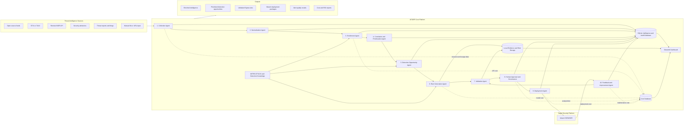

# ATIDEP Full Project Blueprint

## Agentic Threat Intelligence and Detection Engineering Platform

> **Project positioning:** ATIDEP is the technical solution. Cost-effectiveness is a research-analysis dimension used in the project paper to evaluate whether ATIDEP can deliver useful CTI-to-detection outcomes using a fully open-source, resource-conscious architecture.

**Program:** Professional Master's in Information and Cyber Security (PMICS)  
**Institution:** University of Dhaka  
**Project Type:** Master's Final Project in Cybersecurity  
**Prepared for:** Supanta Dutta  
**Document version:** 2.0  
**Date:** 2 October 2026

---

## 1. Project Summary

This project will design, implement, and evaluate a **open-source Agentic Threat Intelligence and Detection Engineering Platform named ATIDEP**. The platform will collect cyber threat intelligence from selected structured and unstructured sources, normalize and enrich the collected information, correlate related indicators and adversary behaviors, calculate relevance and priority, identify detection opportunities, generate detection use cases and Sigma rules, validate the generated content, and prepare approved detections for controlled deployment to Wazuh.

After deployment or simulation, the platform will collect detection results, evaluate alert quality, and recommend rule improvements. A dedicated cost-analysis module will calculate development, infrastructure, deployment, artificial intelligence inference, operation, analyst-review, and maintenance costs.

The project will compare an agentic workflow with a manual detection-engineering workflow using accuracy, processing time, analyst effort, rule quality, resource consumption, reliability, and cost metrics.

The platform is not intended to replace security analysts. It is designed to automate repetitive steps, preserve evidence traceability, provide explainable recommendations, and keep deployment decisions under human and policy control.

---

## 2. Coordinator's Final Project Decision

ATIDEP will be organized as **one technical artifact supported by one research evaluation**.

### 2.1 Technical artifact

ATIDEP will implement the following governed lifecycle:

```text
Collect CTI
→ Normalize and extract evidence
→ Enrich and correlate
→ Prioritize
→ Identify detection opportunities
→ Generate detection use cases and Sigma rules
→ Validate syntax, evidence, and telemetry
→ Obtain human approval
→ Export or deploy to a laboratory Wazuh target
→ Evaluate alerts
→ Recommend improvements
```

### 2.2 Research evaluation

The project paper will evaluate ATIDEP using:

- Extraction accuracy
- Detection-opportunity accuracy
- ATT&CK mapping accuracy
- Rule validity and quality
- Detection success
- False-positive and false-negative behavior
- Processing time
- Analyst effort
- Resource utilization
- Development and operating cost
- Cost per accepted rule and useful alert

### 2.3 Binding scope decision

The minimum viable product will use **Python, FastAPI, Streamlit, SQLite, Sigma, MITRE ATT&CK, selected public CTI sources, and Wazuh as the laboratory target**. Full local deployments of OpenCTI or MISP are not required. A remote MISP API may be added as an optional connector.

ATIDEP will be agentic but not dangerously autonomous. Agents may collect, reason, generate, validate, and recommend. Deployment requires a policy decision and human approval. The platform will never execute arbitrary commands generated by a language model.

### 2.4 Cost-positioning decision

Cost analysis will not dominate the ATIDEP application. The platform will automatically record the measurements required for the paper, including processing duration, model usage, API calls, analyst-review time, CPU/RAM utilization, and accepted outputs. The detailed total-cost-of-ownership and cost-effectiveness analysis will be performed in the research paper and supporting analysis dataset.

### 2.5 Final success statement

ATIDEP will be considered successful if the research demonstrates that, under clearly documented laboratory assumptions, a fully open-source and governed workflow can transform selected threat intelligence into validated detection content with acceptable quality while reducing manual effort or improving cost transparency.

---

## 3. Recommended Project Title

### Primary title

**Design and Evaluation of ATIDEP: An Open-Source Agentic Threat Intelligence and Detection Engineering Platform**

### System name

**ATIDEP**: Agentic Threat Intelligence and Detection Engineering Platform

### Alternative title

**ATIDEP: Transforming Cyber Threat Intelligence into Validated Detection Content Using Open-Source Agentic Automation**

---

## 4. Background

Cyber threat intelligence is produced through open-source feeds, vulnerability advisories, threat reports, malware research, intelligence-sharing communities, and security vendors. However, collected intelligence does not automatically improve security monitoring.

Security teams must normally perform several manual activities:

1. Review threat reports and feeds.
2. Extract indicators and adversary behaviors.
3. Validate and enrich the extracted information.
4. Determine whether the intelligence is relevant to the organization.
5. Correlate intelligence across multiple sources.
6. Map behaviors to MITRE ATT&CK.
7. Identify required telemetry and log sources.
8. Design detection use cases.
9. Write and validate detection rules.
10. Convert detection logic into a target-platform format.
11. Test and deploy approved detection content.
12. Monitor detection results and tune rules.

These tasks are repetitive, time-consuming, and dependent on experienced threat-intelligence and detection-engineering personnel. Commercial platforms can automate portions of the process, but licensing, integration, infrastructure, and support costs may be difficult for resource-constrained organizations.

This project investigates whether a governed agentic workflow built mainly from open-source components can operationalize threat intelligence efficiently while maintaining rule quality, evidence traceability, human oversight, and transparent cost calculation.

---

## 5. Problem Statement

Organizations may collect substantial threat intelligence without having an efficient process to convert relevant intelligence into reliable detections. Indicators can be old, duplicated, invalid, context-free, or unrelated to the monitored environment. Threat reports may describe adversary behavior without providing ready-to-use detection logic. Analysts must manually interpret the intelligence, identify suitable telemetry, create detection rules, test those rules, and tune them after deployment.

A language model can assist with extraction and rule generation, but an unrestricted model can hallucinate evidence, produce invalid rules, recommend unavailable fields, or create excessive false positives. Therefore, the research problem is not simply whether artificial intelligence can draft a detection rule. The core problem is whether a complete, controlled, and auditable agentic process can reliably transform heterogeneous threat intelligence into useful detection content at a measurable and transparent cost.

---

## 6. Research Aim

To design, implement, and experimentally evaluate a open-source ATIDEP platform that transforms heterogeneous cyber threat intelligence into prioritized, explainable, validated, and deployable detection content.

---

## 7. Specific Objectives

1. Develop modular connectors for collecting intelligence from selected sources.
2. Normalize structured and unstructured intelligence into a common internal data model.
3. Extract and validate IP addresses, domains, URLs, file hashes, vulnerabilities, malware names, tools, campaigns, and adversary behaviors.
4. Enrich intelligence with contextual, reputation, recency, and source-reliability information.
5. Correlate intelligence from multiple sources and remove duplicates.
6. Calculate a transparent relevance and priority score.
7. Determine whether an intelligence item creates a valid detection opportunity.
8. Identify the required log source, telemetry, event fields, and ATT&CK techniques.
9. Generate detection use cases and Sigma rule drafts.
10. Validate generated rules for syntax, evidence, telemetry compatibility, quality, and functionality.
11. Convert or package approved detection content for Wazuh.
12. Evaluate resulting alerts and recommend rule tuning, retirement, or enrichment.
13. Implement an approval, versioning, rollback, and audit process.
14. Calculate development, infrastructure, deployment, inference, operation, and maintenance costs.
15. Compare the agentic workflow with a manual detection-engineering workflow.

---

## 8. Main Research Question

> To what extent can a resource-conscious, open-source agentic threat intelligence platform reduce the time, effort, and cost required to transform cyber threat intelligence into reliable and deployable detection content without reducing detection quality, explainability, or operational safety?

### Supporting research questions

1. How accurately can the platform extract indicators, adversary behaviors, affected technologies, and contextual information from heterogeneous intelligence sources?
2. How effectively can the platform enrich, correlate, prioritize, and rank intelligence?
3. Can the platform correctly identify intelligence that is suitable or unsuitable for detection engineering?
4. What proportion of generated Sigma rules pass structural, evidence, telemetry, and functional validation?
5. How accurately can the platform map behaviors to MITRE ATT&CK techniques?
6. Does the agentic workflow reduce detection-development time and analyst effort compared with a manual workflow?
7. Can post-deployment feedback reduce false positives and improve detection relevance?
8. What are the estimated development, infrastructure, inference, operational, and maintenance costs?
9. What is the cost per processed intelligence item, validated rule, deployed rule, and useful alert?

---

## 9. Hypotheses

- **H1:** The agentic workflow will reduce median processing time per intelligence item by at least 30% compared with the manual workflow.
- **H2:** At least 80% of platform-generated rules submitted to the complete validation process will be structurally valid before human editing.
- **H3:** The validation and approval controls will prevent deployment of rules that are syntactically invalid, unsupported by evidence, or incompatible with available telemetry.
- **H4:** The agentic workflow will reduce analyst working time per accepted rule without significantly reducing rule-quality scores.
- **H5:** Feedback-based recommendations will reduce false-positive volume for selected test detections.
- **H6:** Under the stated laboratory assumptions, the open-source workflow will have lower direct software cost than an equivalent manually operated or commercial workflow, while still incurring measurable engineering and maintenance cost.

---

## 10. Project Scope

### Included

- Two or three approved threat-intelligence input types.
- Structured JSON, CSV, STIX, RSS, text, or manually uploaded reports.
- IOC and behavior extraction.
- Deterministic and model-assisted normalization.
- IOC validation and selected enrichment.
- MITRE ATT&CK mapping.
- Transparent prioritization.
- Detection-opportunity analysis.
- Sigma rule generation.
- Rule quality and evidence validation.
- Wazuh-oriented conversion or deployment packaging.
- Controlled test-event execution.
- Human approval before deployment.
- Alert-quality evaluation and recommendations.
- Cost and performance dashboard.
- Complete audit trail.

### Excluded from the minimum viable product

- Production deployment.
- Fully autonomous modification of security controls.
- Arbitrary model-generated command execution.
- Unrestricted internet scraping.
- Real malware execution.
- Collection of customer or production data.
- Full OpenCTI deployment on the 12 GB development computer.
- Enterprise high-availability architecture.
- Claims that laboratory findings prove universal superiority over commercial platforms.

---

## 11. High-Level System Architecture



---

## 12. Architecture Principles

1. **Deterministic before generative:** Use parsers, schemas, regex, lookup tables, and APIs before asking an LLM.
2. **Evidence grounding:** Every generated detection condition must link to source evidence or a documented engineering assumption.
3. **Separation of duties:** Collection, reasoning, validation, approval, and deployment are separate stages.
4. **Human-controlled deployment:** The platform can prepare and recommend content, but deployment requires policy approval.
5. **No arbitrary commands:** The model cannot generate executable deployment commands.
6. **Fail safely:** Invalid output, missing evidence, low confidence, or unavailable telemetry causes rejection or human review.
7. **Version everything:** Intelligence records, mappings, rules, prompts, validation results, and deployments have versions.
8. **Cost observability:** Every agent records processing time, API usage, token usage, analyst time, and resource usage.
9. **Open and modular:** Sources, models, validators, and target platforms use interchangeable adapters.
10. **Resource awareness:** The minimum viable implementation must operate through staged execution on a 12 GB RAM computer.

---

## 13. Recommended Technology Stack

### Core application

- Python 3.11 or newer
- FastAPI for backend APIs
- Streamlit for the research dashboard
- Pydantic for schemas and validation
- SQLAlchemy for data access
- SQLite for development and demonstration
- APScheduler or a simple queue for scheduled collection
- YAML and JSON for configuration

### Threat intelligence

- Requests or HTTPX for source connectors
- STIX 2 Python library where applicable
- PyMISP only when connecting to a remote MISP instance
- Local reference lists for controlled experiments

### Detection engineering

- Sigma as the standard rule format
- Sigma JSON Schema validation
- pySigma or Sigma CLI for conversion where a supported target exists
- Custom Wazuh mapping module where direct conversion is insufficient
- Wazuh `wazuh-logtest` for target-side rule testing

### AI layer

- Provider-neutral LLM adapter
- Small Ollama model for local experiments, or
- Limited cloud model with redacted inputs
- Strict JSON output schema
- Prompt and model version tracking

### Testing and quality

- pytest
- JSON Schema validation
- YAML linting
- Golden test datasets
- Positive, negative, and benign look-alike events

### Documentation and version control

- Git
- Markdown
- Architecture Decision Records
- Requirements lock file
- Environment example file without secrets

---

## 14. ATIDEP Product Identity

### Full name

**ATIDEP: Agentic Threat Intelligence and Detection Engineering Platform**

### Purpose statement

ATIDEP converts selected cyber threat intelligence into evidence-linked, validated, and controlled detection content using open-source components.

### Tagline

**From threat intelligence to trusted detection.**

### Core product boundary

ATIDEP is not a SIEM, threat-intelligence marketplace, or autonomous incident-response platform. ATIDEP is an orchestration and detection-engineering layer that connects intelligence sources to portable detection content and a controlled target platform.

### Primary users

- Threat intelligence analysts
- Detection engineers
- SOC analysts
- Threat hunters
- Security team leads
- Researchers and students

---

## 15. Proposed Repository Structure

```text
atidep/
├── README.md
├── LICENSE
├── requirements.txt
├── pyproject.toml
├── .env.example
├── config/
│   ├── settings.yaml
│   ├── sources.yaml
│   ├── scoring.yaml
│   ├── policies.yaml
│   ├── telemetry_catalog.yaml
│   └── cost_rates.yaml
├── app/
│   ├── main.py
│   ├── api/
│   ├── ui/
│   └── services/
├── agents/
│   ├── collection_agent.py
│   ├── normalization_agent.py
│   ├── enrichment_agent.py
│   ├── correlation_agent.py
│   ├── detection_opportunity_agent.py
│   ├── rule_generation_agent.py
│   ├── validation_agent.py
│   ├── deployment_agent.py
│   └── improvement_agent.py
├── connectors/
│   ├── rss_connector.py
│   ├── json_feed_connector.py
│   ├── stix_connector.py
│   ├── misp_connector.py
│   └── file_upload_connector.py
├── schemas/
│   ├── intelligence.py
│   ├── indicator.py
│   ├── detection_opportunity.py
│   ├── sigma_rule.py
│   ├── validation_result.py
│   └── cost_record.py
├── knowledge/
│   ├── attack_mapping.json
│   ├── telemetry_catalog.json
│   ├── logsource_mapping.json
│   └── reserved_indicators.json
├── rules/
│   ├── drafts/
│   ├── validated/
│   ├── approved/
│   ├── deployed/
│   └── retired/
├── deployment/
│   ├── wazuh_adapter.py
│   ├── packages/
│   └── rollback/
├── data/
│   ├── platform.db
│   ├── uploads/
│   ├── evidence/
│   └── exports/
├── prompts/
│   ├── extraction_v1.md
│   ├── opportunity_v1.md
│   ├── sigma_generation_v1.md
│   └── improvement_v1.md
├── tests/
│   ├── unit/
│   ├── integration/
│   ├── datasets/
│   ├── positive_events/
│   ├── negative_events/
│   └── benign_events/
├── research/
│   ├── ground_truth/
│   ├── experiment_runs/
│   ├── analysis/
│   └── cost_model/
└── docs/
    ├── architecture.md
    ├── deployment.md
    ├── threat_model.md
    ├── data_dictionary.md
    └── user_guide.md
```

---

## 16. Internal Intelligence Data Model

Each intelligence item should be represented consistently.

```json
{
  "intel_id": "TI-2026-0001",
  "title": "Example threat report",
  "source": {
    "name": "example-source",
    "url": "https://example.invalid/report",
    "source_type": "report",
    "retrieved_at": "2026-10-02T10:00:00Z",
    "published_at": "2026-10-01T08:00:00Z",
    "reliability_score": 80
  },
  "classification": {
    "tlp": "CLEAR",
    "confidence": 75,
    "language": "en"
  },
  "indicators": [
    {
      "type": "domain",
      "value": "example.invalid",
      "valid": true,
      "first_seen": null,
      "last_seen": null,
      "confidence": 70,
      "source_evidence_id": "EV-001"
    }
  ],
  "behaviors": [
    {
      "description": "Encoded PowerShell execution",
      "attack_id": "T1059.001",
      "confidence": 85,
      "source_evidence_id": "EV-002"
    }
  ],
  "target_sectors": [],
  "affected_products": [],
  "vulnerabilities": [],
  "priority": {
    "score": 79.75,
    "category": "high",
    "components": {}
  },
  "processing": {
    "status": "normalized",
    "agent_versions": {},
    "model": null,
    "prompt_version": null
  }
}
```

---

## 17. Agent Specifications

### 15.1 Collection Agent

**Purpose:** Acquire intelligence from approved sources.

**Inputs:** Source configuration, collection schedule, last successful checkpoint.  
**Outputs:** Original content, source metadata, checksum, collection status.  
**Tools:** HTTP client, RSS parser, STIX client, PyMISP, file parser.  
**Controls:** Domain allowlist, rate limit, timeout, file-size limit, content-type validation.

**Processing steps:**

1. Read enabled sources.
2. Retrieve new items.
3. Calculate content fingerprint.
4. Reject exact duplicates.
5. Save original evidence.
6. Create an ingestion record.
7. Send accepted items to normalization.

**Failure conditions:** Unapproved domain, invalid certificate policy, unsupported format, parsing error, oversized response, or rate-limit response.

### 15.2 Normalization Agent

**Purpose:** Convert heterogeneous content into the internal intelligence schema.

**Inputs:** Original evidence and source metadata.  
**Outputs:** Normalized intelligence record with evidence references.  
**Controls:** Schema validation and confidence threshold.

**Processing order:**

1. Parse structured fields.
2. Extract indicators deterministically.
3. Normalize time and identifier formats.
4. Extract named malware, tools, vulnerabilities, and behaviors.
5. Use the LLM only for unstructured sections.
6. Link every extracted item to an evidence span.
7. Reject or flag unsupported assertions.

### 15.3 Enrichment Agent

**Purpose:** Improve context and indicator quality.

**Functions:**

- Validate IPv4, IPv6, domain, URL, and hash formats.
- Identify private, loopback, reserved, and documentation-only addresses.
- Check duplicates and prior sightings.
- Add reputation and contextual results.
- Record enrichment source and retrieval time.
- Detect contradictory results.
- Calculate enrichment confidence.

**Important control:** Raw enrichment does not automatically make an indicator malicious. The platform records source, confidence, and disagreement.

### 15.4 Correlation and Prioritization Agent

**Purpose:** Group related information and calculate transparent priority.

```text
Priority Score =
0.25 × Source Reliability
+ 0.20 × Intelligence Confidence
+ 0.20 × Environmental Relevance
+ 0.15 × Recency
+ 0.10 × Cross-Source Correlation
+ 0.10 × Potential Impact
```

**Categories:**

- 0–39: Low
- 40–59: Medium
- 60–79: High
- 80–100: Critical

The interface must display each component, weight, result, and reason. The research evaluation should include sensitivity analysis using alternative weights.

### 15.5 Detection Opportunity Agent

**Purpose:** Decide whether the intelligence can produce a defensible detection.

**Required output:**

```json
{
  "detectable": true,
  "detection_type": "behavioral",
  "detection_concept": "Detect suspicious encoded PowerShell execution",
  "required_log_source": "windows_process_creation",
  "required_fields": ["Image", "CommandLine", "ParentImage"],
  "attack_techniques": ["T1059.001"],
  "false_positive_hypotheses": [
    "Authorized administrative automation",
    "Software deployment activity"
  ],
  "confidence": 0.88,
  "evidence_ids": ["EV-002"],
  "decision_reason": "The behavior is observable through process creation telemetry."
}
```

**Allowed decisions:**

1. IOC-based detection opportunity.
2. Behavioral detection opportunity.
3. Correlation detection opportunity.
4. Hunting query only.
5. Additional telemetry required.
6. Insufficient evidence.
7. Not relevant.
8. Expired or low-value intelligence.

### 15.6 Rule Generation Agent

**Purpose:** Produce a Sigma draft and human-readable use case.

**Required use-case fields:**

- Title
- Objective
- Threat scenario
- ATT&CK mapping
- Required telemetry
- Required fields
- Detection logic
- Expected result
- Known false positives
- Triage guidance
- Test requirements
- References
- Confidence
- Rule owner
- Review date

**Restrictions:**

- Cannot create conditions unsupported by evidence or documented engineering assumptions.
- Cannot invent field names.
- Cannot deploy.
- Must mark all output as `experimental` before validation.

### 15.7 Validation Agent

**Purpose:** Prevent low-quality or unsafe content from reaching deployment.

**Validation gates:**

1. YAML and schema validation.
2. Required metadata validation.
3. Detection-condition validation.
4. Evidence traceability.
5. ATT&CK mapping review.
6. Telemetry compatibility.
7. Positive test.
8. Negative test.
9. Benign look-alike test.
10. Quality score calculation.

```text
Rule Quality Score =
20% Syntax and schema validity
+ 20% Evidence traceability
+ 20% Telemetry compatibility
+ 15% ATT&CK mapping quality
+ 15% False-positive analysis
+ 10% Functional test success
```

**Decision thresholds:**

- Below 60: Reject.
- 60–74: Revision required.
- 75–89: Human review required.
- 90–100: Eligible for approval and controlled deployment.

### 15.8 Human Approval and Governance

**States:**

```text
Draft → Validated → Pending Approval → Approved → Deployed → Monitored
                                      ↘ Rejected
Deployed → Revised → Revalidated → Reapproved
Deployed → Retired
```

**Approval record:**

- Reviewer
- Date and time
- Decision
- Comment
- Rule version
- Validation score
- Deployment target
- Rollback reference

### 15.9 Deployment Agent

**Purpose:** Convert approved content into a controlled target package.

**Wazuh package contents:**

- Original threat-intelligence reference
- Validated Sigma rule
- Converted or mapped Wazuh rule
- Custom rule ID
- Positive sample event
- Negative sample event
- `wazuh-logtest` result
- Required telemetry
- Deployment instructions
- Rollback file
- Approval record
- Version and checksum

**Deployment modes:**

1. Export only.
2. Dry run.
3. Lab deployment after approval.
4. Production deployment is outside the project scope.

### 15.10 Feedback and Improvement Agent

**Inputs:** Detection results, alert dispositions, rule errors, false-positive data, analyst comments, and rule age.

**Recommendations:**

- Add or remove an exclusion.
- Narrow a command-line condition.
- Add parent-process context.
- Add event-count or time-window correlation.
- Change severity.
- Replace an expired IOC.
- Convert IOC logic to behavioral logic.
- Request additional telemetry.
- Merge duplicate rules.
- Retire a low-value rule.

Every recommendation returns to validation and approval.

---

## 18. LLM Governance

### Permitted LLM tasks

- Extract concepts from unstructured text.
- Summarize intelligence.
- Suggest ATT&CK mappings with evidence.
- Draft detection opportunities.
- Draft Sigma rules.
- Explain validation failures.
- Recommend rule improvements.

### Prohibited LLM tasks

- Execute arbitrary code.
- Directly modify Wazuh configuration.
- Deploy a rule without approval.
- Generate offensive payloads.
- Override validation or policy.
- Treat unsupported content as fact.
- Transmit secrets or unredacted sensitive data to a cloud provider.

### Required model metadata

- Provider
- Model name
- Model version
- Temperature and deterministic settings
- Prompt version
- Input and output token count
- Latency
- Estimated cost
- Schema-validation result
- Retry count

---

## 19. Security and Threat Model

### Protected assets

- API credentials
- Threat-intelligence records
- Original reports
- Generated detections
- Approval decisions
- Target-system credentials
- Cost data
- Research results

### Main threats

- Prompt injection inside a collected report.
- Malicious or poisoned threat feed.
- Hallucinated detection logic.
- Credential disclosure.
- Unauthorized rule deployment.
- Rule tampering.
- False intelligence correlation.
- Excessive API or inference cost.
- Data leakage to a cloud model.
- Supply-chain compromise in dependencies.

### Controls

- Treat collected content as untrusted data, not instructions.
- Separate system prompts from report content.
- Allowlist source domains and connector types.
- Validate all model output against Pydantic or JSON Schema.
- Store credentials outside source code.
- Use least-privilege service accounts.
- Sign or hash deployment packages.
- Require approval for deployment.
- Keep immutable audit records where practical.
- Apply token, request, and daily-cost limits.
- Pin dependencies and record versions.
- Redact internal identifiers before cloud inference.

---

## 20. Cost-Analysis Framework

### 18.1 Total cost of ownership

```text
Total Cost of Ownership =
Development Cost
+ Infrastructure Cost
+ Deployment Cost
+ AI Inference Cost
+ Operational Cost
+ Maintenance Cost
```

### 18.2 Development cost

```text
Development Cost =
Design Hours × Design Rate
+ Development Hours × Engineering Rate
+ Test Hours × Test Rate
+ Documentation Hours × Documentation Rate
```

### 18.3 Infrastructure cost

```text
Infrastructure Cost =
Allocated Hardware Cost
+ Storage Cost
+ Electricity Cost
+ Backup Cost
+ Optional Hosting Cost
```

```text
Allocated Hardware Cost =
Purchase Price × Project Usage Percentage × Project Duration / Useful Lifetime
```

### 18.4 Cloud inference cost

```text
Cloud AI Cost =
Input Tokens × Input Token Rate
+ Output Tokens × Output Token Rate
+ Optional Request Charges
```

### 18.5 Local inference cost

```text
Local AI Cost =
Electricity Consumption
+ Hardware Depreciation
+ Storage Allocation
+ Maintenance Allocation
```

### 18.6 Operational cost

```text
Operational Cost =
Analyst Review Time
+ Approval Time
+ Alert Investigation Time
+ Platform Administration Time
```

### 18.7 Maintenance cost

Include:

- Connector updates
- API changes
- Feed-quality review
- Prompt maintenance
- Model evaluation
- Detection tuning
- Dependency updates
- Backup and recovery
- Documentation updates

### 18.8 Unit economics

```text
Cost per Intelligence Item =
Total Processing Cost / Intelligence Items Processed
```

```text
Cost per Generated Rule =
Total Pipeline Cost / Rules Generated
```

```text
Cost per Accepted Rule =
Total Pipeline Cost / Rules Approved
```

```text
Cost per Useful Alert =
Total Operating Cost / Confirmed Relevant Alerts
```

```text
Automation Saving =
Manual Workflow Cost - Agentic Workflow Cost
```

```text
ROI Percentage =
Automation Saving / Agentic Platform Cost × 100
```

### 18.9 Required cost events

Every workflow stage should emit a cost record containing:

- Run ID
- Intelligence item ID
- Agent name
- Start and end time
- Processing duration
- CPU and memory estimate
- API calls
- Input and output tokens
- Model price snapshot
- Analyst minutes
- Infrastructure allocation
- Result status

---

## 21. Dashboard Requirements

### Page 1: Executive Overview

- Intelligence collected
- New and duplicate items
- High-priority intelligence
- Detection opportunities
- Rules generated
- Rules validated
- Rules awaiting approval
- Rules deployed
- Alert-quality trend
- Total and unit cost

### Page 2: Intelligence Analysis

- Source distribution
- Indicator types
- Top ATT&CK techniques
- Priority breakdown
- Source reliability
- Recency
- Correlation graph
- Evidence viewer

### Page 3: Detection Opportunities

- Detectable and non-detectable items
- Required telemetry
- Detection type
- Confidence
- Reason for rejection
- Proposed use case

### Page 4: Rule Workbench

- Sigma editor
- Evidence links
- ATT&CK mapping
- Validation errors
- Quality score
- Positive and negative tests
- Version history

### Page 5: Approval Queue

- Pending rules
- Validation score
- Risk level
- Reviewer decision
- Approval comments
- Deployment mode

### Page 6: Detection Results

- Alert count
- True positives
- False positives
- False negatives
- Rule errors
- Alert volume by rule
- Improvement recommendations

### Page 7: Cost Analysis

- Cost by lifecycle stage
- Development versus recurring cost
- Local versus cloud inference
- Cost per intelligence item
- Cost per generated and accepted rule
- Cost per useful alert
- Manual versus agentic comparison
- Sensitivity analysis

---

## 22. Implementation Plan for a 12 GB RAM Computer

### Recommended environment

- Windows 10 or 11 host.
- Python application runs natively or through WSL.
- SQLite database.
- Streamlit dashboard.
- Wazuh hosted in one Ubuntu Server VM only when required.
- Small local Ollama model or cloud API, not both simultaneously.
- No local OpenCTI deployment.
- Remote MISP API only if available.

### Staged execution

#### Development mode

```text
Windows host
+ Python backend
+ Streamlit
+ SQLite
```

#### Local AI mode

```text
Windows host
+ Python application
+ small Ollama model
Wazuh VM stopped if not required
```

#### Wazuh test mode

```text
Windows host
+ Python application
+ Ubuntu Wazuh VM
Ollama stopped; use saved model output or cloud API if permitted
```

#### Reporting mode

```text
Windows host
+ exported SQLite/CSV results
All optional VMs stopped
```

### Minimum viable product

1. One RSS or JSON collector.
2. One file-upload collector.
3. Normalized intelligence schema.
4. IOC and behavior extraction.
5. Local indicator validation.
6. ATT&CK mapping.
7. Priority scoring.
8. Detection-opportunity decision.
9. Sigma generation.
10. Structural and evidence validation.
11. Human approval.
12. Wazuh deployment package export.
13. Positive and negative tests.
14. Feedback recommendation.
15. Cost dashboard.

---

## 23. Development Phases

### Phase 1: Research and requirements

- Review CTI operationalization and detection engineering literature.
- Finalize research questions and metrics.
- Select intelligence sources.
- Define internal schema.
- Define safety and approval policies.
- Prepare ground-truth dataset.

### Phase 2: Core data pipeline

- Build collectors.
- Store original evidence.
- Implement deduplication.
- Implement deterministic IOC extraction.
- Add normalized storage.
- Build audit records.

### Phase 3: Enrichment and prioritization

- Add indicator validation.
- Add selected enrichment adapters.
- Implement correlation.
- Implement scoring formula.
- Add scoring explanation.

### Phase 4: Detection engineering

- Implement detection-opportunity schema.
- Build ATT&CK and telemetry knowledge base.
- Generate use cases.
- Generate Sigma drafts.
- Record evidence links.

### Phase 5: Validation and governance

- Add YAML and Sigma validation.
- Add evidence validation.
- Add telemetry compatibility checks.
- Add quality scoring.
- Build approval queue and versioning.

### Phase 6: Wazuh integration

- Build Wazuh conversion or mapping.
- Generate positive and negative test events.
- Run `wazuh-logtest`.
- Export controlled deployment packages.
- Record deployment and rollback information.

### Phase 7: Feedback and cost modules

- Collect alert results.
- Add analyst disposition.
- Generate improvement recommendations.
- Record token, API, time, and resource usage.
- Build cost calculations and dashboards.

### Phase 8: Experiment and reporting

- Freeze configurations and prompts.
- Execute manual baseline.
- Execute agentic workflow.
- Analyze results.
- Perform error and cost analysis.
- Document limitations.
- Prepare final report and demonstration.

---

## 24. Suggested 16-Week Schedule

| Week | Activities | Deliverable |
|---|---|---|
| 1–2 | Literature review, requirements, research design | Approved proposal |
| 3 | Data model, source selection, threat model | Architecture and schemas |
| 4–5 | Collection, storage, deduplication, normalization | Working ingestion pipeline |
| 6 | Enrichment and indicator validation | Enrichment module |
| 7 | Correlation and priority scoring | Explainable prioritization |
| 8 | Detection-opportunity analysis | Opportunity agent |
| 9 | Sigma and use-case generation | Rule-generation module |
| 10 | Validation, scoring, and telemetry checks | Validation agent |
| 11 | Approval, versioning, and audit workflow | Governance module |
| 12 | Wazuh package export and test integration | Deployment module |
| 13 | Feedback and improvement workflow | Improvement module |
| 14 | Cost engine and dashboard | Cost-analysis module |
| 15 | Manual and agentic experiments | Experimental dataset |
| 16 | Analysis, report, demo, and defense preparation | Final project deliverables |

---

## 25. Experimental Design

### 23.1 Study design

Use a controlled paired comparison:

- **Condition A:** Manual CTI-to-detection workflow.
- **Condition B:** Agentic CTI-to-detection workflow.

The same intelligence items and target telemetry assumptions should be used in both conditions.

### 23.2 Dataset categories

Prepare at least 30 intelligence items if time permits:

- 10 IOC-focused items.
- 10 behavior-focused items.
- 5 mixed IOC and behavior items.
- 5 unsuitable, vague, duplicate, expired, or irrelevant items.

Use a separate pilot set for prompt and rule tuning. Do not report the pilot set as final test evidence.

### 23.3 Ground truth

Each item should include:

- Expected indicators.
- Expected behaviors.
- Expected ATT&CK mapping.
- Detectable or non-detectable label.
- Required telemetry.
- Expected rule concept.
- Required evidence.
- Expected false-positive considerations.

A supervisor or qualified second reviewer should review a sample where possible.

### 23.4 Manual baseline procedure

1. Read the intelligence.
2. Extract indicators and behaviors.
3. Enrich and correlate.
4. Assign priority.
5. Identify a detection opportunity.
6. Create use case and Sigma rule.
7. Validate and test.
8. Prepare Wazuh deployment content.
9. Record time, edits, and decision.

### 23.5 Agentic procedure

1. Ingest the same intelligence.
2. Run collection and normalization.
3. Run enrichment and correlation.
4. Calculate priority.
5. Generate the opportunity decision.
6. Generate the use case and Sigma rule.
7. Run all validation gates.
8. Conduct human review.
9. Test and prepare deployment.
10. Record all automatic and manual effort.

---

## 26. Evaluation Metrics

### Intelligence extraction

- Precision
- Recall
- F1 score
- Unsupported extraction rate
- Evidence-link accuracy

### Correlation and prioritization

- Duplicate-detection accuracy
- Ranking agreement with expert labels
- Priority classification accuracy
- Explanation completeness

### Detection opportunity

- Detectable/non-detectable accuracy
- Precision and recall for valid opportunities
- Telemetry requirement accuracy
- False opportunity rate

### Rule generation

- YAML validity
- Sigma schema-valid rate
- ATT&CK mapping accuracy
- Required-field accuracy
- Evidence-supported condition rate
- Human acceptance rate
- Number of edits before approval

### Functional detection

- Positive test success
- Negative test success
- Benign look-alike rejection
- True positives
- False positives
- False negatives
- Rule execution errors

### Efficiency

- End-to-end processing time
- Analyst active time
- Automated processing time
- Number of manual interventions
- Time to accepted rule

### Reliability and safety

- Workflow failure rate
- Invalid model-output rate
- Retry rate
- Hallucination rate
- Unauthorized deployment attempts
- Policy rejection rate

### Cost

- Total project cost
- Recurring monthly cost
- Cost per intelligence item
- Cost per generated rule
- Cost per accepted rule
- Cost per useful alert
- Manual versus agentic cost difference

---

## 27. Statistical Analysis

1. Use descriptive statistics for all metrics.
2. Report median and interquartile range for time and cost if distributions are skewed.
3. Use paired comparisons for identical intelligence items processed manually and agentically.
4. Use a paired t-test only when assumptions are satisfied.
5. Otherwise, use the Wilcoxon signed-rank test.
6. Report effect sizes and 95% confidence intervals.
7. Use confusion matrices for extraction, opportunity classification, and detection results.
8. Report precision, recall, macro-F1, and accuracy.
9. Perform sensitivity analysis on priority weights and cost assumptions.
10. Separate results by IOC-based, behavior-based, and unsuitable intelligence.

---

## 28. Demonstration Scenarios

### Scenario 1: IOC-based detection

```text
Input threat report
→ domain and IP extraction
→ indicator validation and enrichment
→ priority score
→ IOC-based Sigma rule
→ validation
→ Wazuh package
→ synthetic matching log
→ test alert
→ cost report
```

### Scenario 2: Behavior-based detection

```text
Input report describing encoded PowerShell
→ behavior extraction
→ ATT&CK T1059.001 mapping
→ process-creation telemetry requirement
→ Sigma rule
→ positive and benign tests
→ validation
→ approval
→ Wazuh test
```

### Scenario 3: Rejected intelligence

```text
Old, unsupported, duplicated, or vague intelligence
→ low confidence or no observable behavior
→ no detection rule produced
→ rejection reason and recommendation recorded
```

### Scenario 4: Detection improvement

```text
Existing rule generates benign alerts
→ analyst dispositions collected
→ pattern analyzed
→ exclusion or context recommended
→ revised rule validated
→ original and revised false-positive rates compared
```

### Scenario 5: Missing telemetry

```text
Threat behavior requires PowerShell Script Block Logging
→ telemetry catalog reports Event ID 4104 unavailable
→ platform blocks deployment
→ recommends enabling required logging
```

---

## 29. Acceptance Criteria

The minimum viable project is successful when:

- At least two source types are supported.
- Original evidence and normalized intelligence are stored.
- Indicators and behaviors are extracted with traceable evidence.
- Duplicate and unsuitable intelligence can be rejected.
- Priority scoring is transparent.
- Detection opportunities identify required telemetry.
- Sigma rule drafts are generated.
- All rule drafts pass through validation.
- No invalid or unapproved rule is deployed.
- Wazuh deployment packages can be generated and tested.
- Positive, negative, and benign tests are recorded.
- Feedback produces at least one measurable improvement recommendation.
- Cost per intelligence item and accepted rule is calculated.
- A manual versus agentic comparison is completed.
- All actions are auditable by run ID and version.

---

## 30. Risks and Mitigations

| Risk | Effect | Mitigation |
|---|---|---|
| LLM hallucination | Unsupported rule logic | Evidence grounding, schemas, validation, human review |
| Prompt injection in reports | Agent manipulation | Treat source text as untrusted data and isolate instructions |
| Poor feed quality | Incorrect prioritization | Source scoring, cross-source correlation, rejection states |
| Expired indicators | Low-value alerts | Recency scoring and automatic expiry review |
| Missing telemetry | Undeployable rule | Telemetry catalog and compatibility gate |
| Excessive false positives | Analyst overload | Benign tests, tuning loop, quality thresholds |
| API cost growth | Budget overrun | Request limits, caching, token accounting, daily cap |
| Limited 12 GB RAM | Slow or unstable lab | Staged execution and lightweight components |
| Wazuh conversion mismatch | Failed deployment | Export package, `wazuh-logtest`, and manual review |
| Weak commercial comparison | Unsupported claims | Clearly defined assumptions and scenario-based comparison |
| Dependency changes | Reproducibility loss | Version pinning and environment documentation |
| Sensitive data leakage | Privacy issue | Redaction, local inference, secrets management |

---

## 31. Ethical, Legal, and Privacy Controls

- Use only public, licensed, or explicitly authorized threat-intelligence sources.
- Follow source terms, rate limits, and redistribution restrictions.
- Do not store production credentials or personal information.
- Use synthetic organizations, hosts, users, and events.
- Do not execute real malware.
- Keep all Wazuh tests inside an isolated laboratory.
- Redact sensitive fields before cloud inference.
- Record model provider and transmitted fields.
- Keep deployment human-controlled.
- Publish only de-identified research data.
- Report failures and limitations objectively.

---

## 32. Organization of the Technical Project and Research Paper

### 31.1 Technical project deliverables

The software implementation will focus on:

1. CTI collection and upload.
2. Normalization and evidence preservation.
3. IOC and behavior extraction.
4. Enrichment, correlation, and prioritization.
5. Detection-opportunity identification.
6. Detection use-case and Sigma generation.
7. Syntax, evidence, telemetry, and functional validation.
8. Human approval and version control.
9. Laboratory Wazuh export, testing, or deployment.
10. Detection feedback and improvement recommendations.
11. Operational measurement collection for the research dataset.

### 31.2 Research paper structure

1. **Introduction:** Context, problem, aim, objectives, questions, scope, and contributions.
2. **Literature Review:** CTI, detection engineering, Sigma, ATT&CK, agentic AI, validation, human oversight, open-source platforms, and cost-effectiveness.
3. **Research Methodology:** Design-science approach, experiment design, ground truth, metrics, statistics, ethics, and cost methodology.
4. **Requirements and Architecture:** ATIDEP requirements, agent design, data flow, database, threat model, and governance.
5. **Implementation:** Technology stack, modules, integrations, prompts, schemas, validation, dashboard, and Wazuh adapter.
6. **Experimental Setup:** Hardware, software versions, dataset, manual baseline, agentic condition, test events, and cost assumptions.
7. **Results:** Technical performance, analyst-effort results, resource usage, and cost results.
8. **Discussion:** Interpretation, trade-offs, open-source benefits, hidden costs, failure analysis, scalability, and practical implications.
9. **Conclusion and Future Work:** Answers to research questions, contributions, limitations, and future development.

### 31.3 Separation rule

The software dashboard may show a concise cost-observability page, but the detailed cost model, assumptions, scenario analysis, sensitivity analysis, and comparison belong in the research paper and analysis files. This prevents the security solution from becoming primarily a financial calculator.

---

## 33. Expected Contributions

1. A reusable open-source reference architecture for CTI operationalization.
2. A modular agent design for collection, enrichment, detection engineering, validation, and improvement.
3. An evidence-linked method for generating detection content.
4. A transparent detection-opportunity decision model.
5. A governed Sigma-to-Wazuh workflow.
6. A rule-quality scoring model.
7. A cost-accounting model for agentic security engineering.
8. An experimental comparison between manual and agentic workflows.
9. A resource-constrained deployment approach suitable for academic laboratories and small security teams.

---

## 34. Expected Deliverables

- Final research proposal.
- Literature review.
- Source code repository.
- Configuration templates.
- Internal data schemas.
- Threat model.
- Sample intelligence dataset.
- Ground-truth labels.
- Generated Sigma rules.
- Wazuh deployment packages.
- Test-event dataset.
- Validation reports.
- Cost-analysis workbook or dashboard.
- Experiment dataset and statistical analysis.
- Installation and user guide.
- Final dissertation/project report.
- Demonstration script.
- Defense presentation.

---

## 35. Final Demonstration Flow

1. Open the dashboard.
2. Display configured intelligence sources.
3. Collect or upload a threat report.
4. Show the original evidence and checksum.
5. Show extracted indicators and behaviors.
6. Show enrichment and correlation results.
7. Show transparent priority calculation.
8. Show the detection-opportunity decision.
9. Show required telemetry and ATT&CK mapping.
10. Generate the Sigma draft.
11. Run structural, evidence, telemetry, and functional validation.
12. Display the quality score.
13. Submit for human approval.
14. Generate the Wazuh deployment package.
15. Test with a synthetic event.
16. Display the resulting alert or test result.
17. Add analyst disposition.
18. Generate an improvement recommendation.
19. Display processing time, analyst effort, token use, and cost.
20. Compare the result with the manual baseline.

---

## 36. How to Present the Final Claim

Do not claim that the platform is universally the best solution.

Use an evidence-based conclusion:

> Under the defined laboratory scenarios and resource assumptions, the proposed open-source ATIDEP reduced the time and analyst effort required to transform selected threat-intelligence items into validated detection content. The platform maintained evidence traceability, human-controlled deployment, measurable rule quality, and transparent cost accounting. The results indicate that the architecture can be a practical option for small security teams and academic environments, subject to the documented limitations and maintenance requirements.

---

## 37. Recommended First Build Order

Build the project in this exact sequence:

1. Create the repository and configuration files.
2. Create SQLite tables and Pydantic schemas.
3. Implement manual file upload.
4. Implement one RSS or JSON collector.
5. Store original evidence and checksums.
6. Implement deterministic IOC extraction.
7. Add behavior extraction and evidence links.
8. Build enrichment using local and free sources.
9. Implement correlation and priority scoring.
10. Create the detection-opportunity schema and decision logic.
11. Generate a human-readable detection use case.
12. Generate Sigma YAML.
13. Add YAML and Sigma schema validation.
14. Add telemetry compatibility validation.
15. Add positive, negative, and benign test cases.
16. Add human approval and version states.
17. Build Wazuh package export.
18. Add `wazuh-logtest` integration.
19. Add feedback and improvement recommendations.
20. Add cost records and dashboard.
21. Freeze a version for formal experimentation.
22. Run the manual and agentic comparison.

---

## 38. Initial Database Tables

- `sources`
- `collection_runs`
- `intelligence_items`
- `evidence_segments`
- `indicators`
- `behaviors`
- `enrichment_results`
- `correlations`
- `priority_scores`
- `detection_opportunities`
- `use_cases`
- `rules`
- `rule_versions`
- `validation_results`
- `approvals`
- `deployment_packages`
- `deployments`
- `detection_results`
- `analyst_dispositions`
- `improvement_recommendations`
- `model_runs`
- `cost_records`
- `audit_events`

---

## 39. Suggested API Endpoints

```text
POST   /sources
GET    /sources
POST   /collection/run
POST   /intelligence/upload
GET    /intelligence
GET    /intelligence/{id}
POST   /intelligence/{id}/normalize
POST   /intelligence/{id}/enrich
POST   /intelligence/{id}/prioritize
POST   /intelligence/{id}/opportunity
POST   /opportunities/{id}/generate-rule
POST   /rules/{id}/validate
POST   /rules/{id}/approve
POST   /rules/{id}/reject
POST   /rules/{id}/build-wazuh-package
POST   /rules/{id}/test
POST   /rules/{id}/deploy-lab
POST   /detections/{id}/feedback
GET    /costs/summary
GET    /experiments/{id}/results
GET    /audit
```

---

## 40. Key Configuration Files

### `scoring.yaml`

```yaml
priority_weights:
  source_reliability: 0.25
  intelligence_confidence: 0.20
  environmental_relevance: 0.20
  recency: 0.15
  cross_source_correlation: 0.10
  potential_impact: 0.10

priority_thresholds:
  low: 0
  medium: 40
  high: 60
  critical: 80
```

### `policies.yaml`

```yaml
rule_generation:
  minimum_opportunity_confidence: 0.70
  require_evidence_ids: true

validation:
  minimum_review_score: 75
  minimum_deployment_score: 90
  require_positive_test: true
  require_negative_test: true
  require_benign_test: true

approval:
  deployment_requires_human: true
  allow_automatic_production_deployment: false

llm:
  permit_command_generation: false
  redact_sensitive_fields: true
  reject_non_schema_output: true
  daily_cost_limit: 5.00
```

### `cost_rates.yaml`

```yaml
currency: BDT
labor:
  analyst_hourly_rate: 800
  engineer_hourly_rate: 1200
  reviewer_hourly_rate: 1500

infrastructure:
  electricity_per_kwh: 15
  hardware_monthly_allocation: 1500
  storage_monthly_allocation: 300

cloud_ai:
  input_cost_per_million_tokens: 0
  output_cost_per_million_tokens: 0

maintenance:
  monthly_connector_hours: 4
  monthly_rule_tuning_hours: 6
  monthly_platform_admin_hours: 4
```

The cost values above are placeholders. Replace them with documented assumptions before the formal experiment.

---

## 41. References and Official Technical Sources

1. MISP Project. **MISP OpenAPI Specification**. https://www.misp-project.org/openapi/
2. CIRCL. **Automation and MISP API**. https://www.circl.lu/doc/misp/automation/
3. OpenCTI. **Connectors Documentation**. https://docs.opencti.io/latest/deployment/connectors/
4. SigmaHQ. **Sigma Specification**. https://github.com/SigmaHQ/sigma-specification
5. SigmaHQ. **Sigma Detection Format**. https://sigmahq.io/
6. MITRE. **MITRE ATT&CK**. https://attack.mitre.org/
7. Wazuh. **Custom Rules Documentation**. https://documentation.wazuh.com/current/user-manual/ruleset/rules/custom.html
8. Wazuh. **Quickstart Documentation**. https://documentation.wazuh.com/current/quickstart.html
9. OASIS Open. **STIX Version 2.1**. https://docs.oasis-open.org/cti/stix/v2.1/stix-v2.1.html
10. OASIS Open. **TAXII Version 2.1**. https://docs.oasis-open.org/cti/taxii/v2.1/taxii-v2.1.html

---

## 42. Final One-Paragraph Proposal Description

For the Master's Final Project in Cybersecurity, this research will design and evaluate a open-source ATIDEP platform for threat intelligence operationalization and detection engineering. The platform will collect selected cyber threat intelligence, normalize and enrich indicators and adversary behaviors, correlate and prioritize relevant information, identify valid detection opportunities, generate Sigma detection rules and monitoring use cases, validate the generated content, and prepare approved rules for controlled deployment to Wazuh. The platform will collect detection results and recommend rule improvements while preserving evidence traceability, version control, policy enforcement, and human approval. A dedicated cost engine will measure development, infrastructure, deployment, AI inference, operation, analyst-review, and maintenance costs. The agentic workflow will be compared with a manual workflow using accuracy, rule quality, processing time, analyst effort, reliability, resource utilization, and cost metrics to determine whether the proposed architecture is a practical and cost-effective option for small security teams and academic environments.
